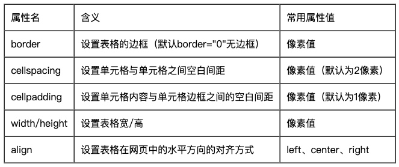

# 表格的基本使用

## 表格 table

表格table **常用于显示、展示表格式数据**，它可以让数据显示的非常的规整，可读性非常好。但它不是用来布局的。

**表格的基本语法：**

```
<table>
  <tr>
    <td>单元格内的文字</td>
    ...
  </tr>
  ...
</table>
```

1. `table`用于定义一个表格标签。

2. `tr`标签 用于定义表格中的行，必须嵌套在`table`标签中。

3. `td`用于定义表格中的单元格，必须嵌套在`<tr></tr>`标签中。

4. 字母 `td` 指表格数据`（table data）`，即数据单元格的内容，现在我们明白，表格最合适的地方就是用来存储数据的。

**总结：**

* 表格的主要目的是用来显示特殊数据的
* 一个完整的表格有表格标签`（table）`，行标签`（tr）`，单元格标签`（td）`组成，没有列的标签
* `<tr></tr>` 中只能嵌套 `<td></td>` 类的单元格
* `<td></td>` 标签，他就像一个容器，可以容纳所有的元素
* 表格中没有列元素，列的个数取决于行的单元格个数。

### 表格属性



* 表格有部分属性我们不常用，这里重点记住 cellspacing 、 cellpadding。
* 我们经常有个说法，是三参为0，平时开发的我们这三个参数 `border  cellpadding  cellspacing` 为  0


### 表头单元格标签th

表头单元格标签th：一般表头单元格位于表格的第一行或第一列，并且文本加粗居中。

* 只需用表头标签 `<th></th>` 替代相应的单元格标签`<td></td>`即可。 

* `th` 也是一个单元格   只不过和普通的 `td`单元格不一样，它会让自己里面的文字居中且加粗

```
<table>
	<tr>
		<th>姓名</th>
		<th>性别</th>
		<th>年龄</th>
	</tr>
	<tr>
		<th>小李子</th>
		<td>男</td>
		<td>20</td>
	</tr>
	<tr>
		<th>王麻子</th>
		<td>女</td>
		<td>22</td>
	</tr>
</table>
```

### 表格标题caption

**定义和用法：**

```
<table>
   <caption>我是表格标题</caption>
</table>
```

1. caption 元素定义**表格标题**，通常这个标题会被居中且显示于表格之上。
2. caption 标签必须紧随 table 标签之后。
3. 这个标签只存在 表格里面才有意义。

### 合并单元格

#### 合并单元格2种方式:

* 跨行合并：`rowspan="合并单元格的个数"`      
* 跨列合并：`colspan="合并单元格的个数"`

> **合并的顺序我们按照 &nbsp;&nbsp;  先上 后下，先左  后右 &nbsp;&nbsp;的顺序**。和汉字书写方向一致。

#### 合并单元格的步骤：

1. 先按要求书写正常的单元格
2. 再确定是跨行还是跨列合并
3. 根据 `先上 后下 &nbsp;&nbsp; 先左 后右` 的原则找到目标单元格。然后写上 合并方式 还有 要合并的单元格数量  比如 ： `<td colspan="3">   </td>`
4. 删除多余的单元格 单元格   

```
<table align="center" border="1" cellspacing="0" cellpadding="10">
	<caption>个人简介</caption>
	<tr>
		<td><strong>姓名：</strong>小李子</td>
		<td><strong>性别：</strong>男</td>
		<td><strong>年龄：</strong>20</td>
		<td rowspan="2">照片</td>
	</tr>
	<tr>
		<td><strong>身高：</strong>180</td>
		<td><strong>民族：</strong>满</td>
		<td><strong>婚姻：</strong>未婚</td>
	</tr>
	<tr>
		<th>个人简介</th>
		<td colspan="3"></td>
	</tr>
</table>
```

### 表格划分结构

对于比较复杂的表格，表格的结构也就相对的复杂了，所以又将表格分割成三个部分：题头、正文和脚注。而这三部分分别用:`thead、tbody、tfoot`来标注， 这样更好的分清表格结构。

**注意**

1. `<thead></thead>`：用于定义表格的头部。用来放标题之类的东西。`<thead>` 内部必须拥有 `<tr> `标签。
2. `<tbody></tbody>`：用于定义表格的主体。放数据本体 。
3. `<tfoot></tfoot>`放表格的脚注之类。
4. 以上标签都是放到`table`标签中。

```
<table border="1" cellspacing="0" align="center" width="500">
   <caption>表格标题</caption>
	<thead>
		<tr>
			<th>姓名</th>
			<th>性别</th>
			<th>年龄</th>
		</tr>
	</thead>
	<tbody>
		<tr>
			<td>刘德华</td>
			<td>男</td>
			<td>55</td>
		</tr>
		<tr>
			<td>刘若英</td>
			<td>女</td>
			<td>35</td>
		</tr>
		<tr>
			<td>刘晓庆</td>
			<td>女</td>
			<td>65</td>
		</tr>
		<tr>
			<td>刘三姐</td>
			<td>女</td>
			<td>15</td>
		</tr>
	</tbody>
	<tfoot>
		<tr>
			<td>信息地址</td>
			<td colspan="2"> 北京市金燕龙校区举办演唱会</td>		
		</tr>
	</tfoot>
</table>
```