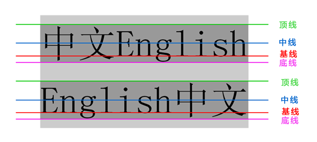
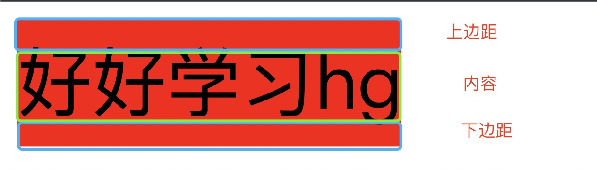

## 一、行高 line-height




 行高我们利用最多的一个地方是： 可以让单行文本在盒子中垂直居中对齐。
 
 > **文字的行高等于盒子的高度。**

由上面的规则我们可以看出：
 
* 行高  =  上距离 +  内容高度  + 下距离 

当设置的行高上距离和下距离总是相等的，那么文字看上去就是垂直居中的。



```
span {
	display: inline-block;
	height: 60px;
	background-color: red;
	font-size: 35px;
	
	line-height: 60px;
}

<span>好好学习hg</span>
```

**行高和高度的三种关系**

- 如果 行高 等 高度  文字会 垂直居中
- 如果行高 大于 高度   文字会 偏下 
- 如果行高小于高度   文字会  偏上 
 

## 二、背景 background
 
通过css背景属性，可以给html页面元素添加背景样式。
 
```css
// 默认 transparent 透明;
background-color: transparent;     

// 默认 none 无背景图;  提倡 背景图片后面的地址，url不要加引号。
background-image : none | url (url);`  
 
// 背景平铺，默认值为 `repeat`，表示背景图像在纵向和横向上平铺。
background-repeat : repeat | no-repeat | repeat-x | repeat-y;   

// 背景附着：scroll 背景图像是随对象内容滚动; fixed 背景图像固定 
background-attachment : scroll | fixed;

``` 

### 1、背景位置(重点)

注意在设置 background-position 时，必须先指定 background-image。

```
background-position : x坐标 y坐标;
```

`x, y` 的值可以是 精确单位(由浮点数字和单位标识符组成的长度值) 或者 方位名词(`top`、`center`、`bottom`、`left`、`center`、`right`)。


* 如果指定两个值，两个值都是方位名字，则两个值前后顺序无关，比如 `left top` 和 `top left` 效果一致。

* 如果只指定了一个方位名词，另一个值默认居中对齐。

* 如果 `position` 后面是精确坐标，那么第一个肯定是 x  第二的一定是y。

* 如果只指定一个数值,那该数值一定是x坐标，另一个默认垂直居中

* 如果指定的两个值是 精确单位和方位名字混合使用，则第一个值是x坐标，第二个值是y坐标

**实际工作用的最多的，就是背景图片居中对齐了。**


<style>
	.bg {
		width: 600px;
		height: 300px;
		background-color: pink;
		background-image: url(bg.png);
		background-repeat: no-repeat;
		background-position: 100px bottom;
	}
</style>

<div class="bg">123</div>
```

### 2、背景简写

`background属性` 的值的书写顺序官方并没有强制标准的。为了可读性，建议大家如下写：

```
background: 背景颜色 背景图片地址 背景平铺 背景滚动 背景位置;

background: transparent url(image.jpg) repeat-y  scroll center top ;

background: url('@/assets/banner_bg_dark.png') no-repeat center center / cover;
```

### 3、背景透明

```
background: rgba(0, 0, 0, 0.3);
```

- 最后一个参数是alpha 透明度  取值范围 0~1之间
- 我们习惯把0.3 的 0 省略掉  这样写  background: rgba(0, 0, 0, .3);
- 注意：  背景半透明是指盒子背景半透明， 盒子里面的内容不受影响
- 因为是CSS3 ，所以 低于 ie9 的版本是不支持的。


**8、背景图宽度固定 等比例缩放**

[CSS设置背景图宽度100%，高度自适应](https://blog.csdn.net/qq_38791687/article/details/103480664)

```
.ui_banner {
    margin: 24px auto 24px;
    width: 100%;
    height: 0px;
    padding-top: 20.5%;     // 需要先确定背景图的长宽比,然后padding-top的值就位百分比的值
    background: url('../../assets/img/newcenter.png') no-repeat;
    background-size: 100% auto;
}

.ui_banner:before {
    content: ""; 
    display: block; 
    padding-top: 100%;
}
```


## 学习博客

[CSS中背景图片定位方法](https://www.ruanyifeng.com/blog/2008/05/css_background_image_positioning.html)

