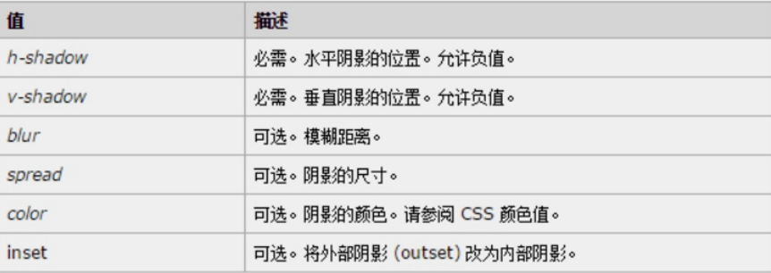

# CSS3 圆角、阴影

## 圆角

`border-radius` 用来设置盒子圆角，可以为具体值，也可以为百分比。

eg：如下绘制一个正圆盒子：

```html
<style type="text/css">
	div {
		width: 200px;
		height: 200px;
		background-color: pink;
		/*设置圆，一般为宽度的一半*/
		/*border-radius: 100px;*/
		/*通常写50%，表示宽高都为一半*/
		border-radius: 50%;
	}
</style>

<div></div>
```

eg：如下绘制一个圆角盒子，为高度的一半：
```
<style type="text/css">
	p {
		width: 80px;
		height: 20px;
		font-size: 12px;
		color: #fff;
		background-color: red;
		line-height: 20px;
		text-align: center;
      /*设置圆角按钮*/
		border-radius: 10px;
	}
</style>

<p>立即购买</p>
```

## 盒子阴影

盒子阴影语法格式：

`box-shadow:水平阴影 垂直阴影 模糊距离（虚实）  阴影尺寸（影子大小）  阴影颜色  内/外阴影；`



⚠️：外阴影 (`outset`) 是默认的 但是不能写 想要内阴影可以写 `inset`

```html
div {
		width: 200px;
		height: 200px;
		border: 10px solid red;
		/* box-shadow: 5px 5px 3px 4px rgba(0, 0, 0, .4);  */
		/* box-shadow:水平位置 垂直位置 模糊距离 阴影尺寸（影子大小） 阴影颜色  内/外阴影； */
		box-shadow: 0 15px 30px  rgba(0, 0, 0, .4);
		
}
```

# CSS书写规范

## 空格规范

【强制】 选择器 与 { 之间必须包含空格。

示例：

.selector {
}
【强制】 属性名 与之后的 : 之间不允许包含空格， : 与 属性值 之间必须包含空格。

示例：

font-size: 12px;

## 选择器规范

【强制】 并集选择器，每个选择器声明必须独占一行。

示例：

```html
/* good */
.post,
.page,
.comment {
    line-height: 1.5;
}


/* bad */
.post, .page, .comment {
    line-height: 1.5;
}
```

【建议】 一般情况情况下，**选择器的嵌套层级应不大于 3 级**，位置靠后的限定条件应尽可能精确。

示例：

```html
/* good */
#username input {}
.comment .avatar {}

/* bad */
.page .header .login  input {}
.comment div * {}
```

## 属性规范

【强制】 属性定义必须另起一行。

示例：

```html
/* good */
.selector {
    margin: 0;
    padding: 0;
}

/* bad */
.selector { margin: 0; padding: 0; }
```

【强制】 属性定义后必须以分号结尾。

示例：

```html
/* good */
.selector {
    margin: 0;
}

/* bad */
.selector {
    margin: 0
}
```