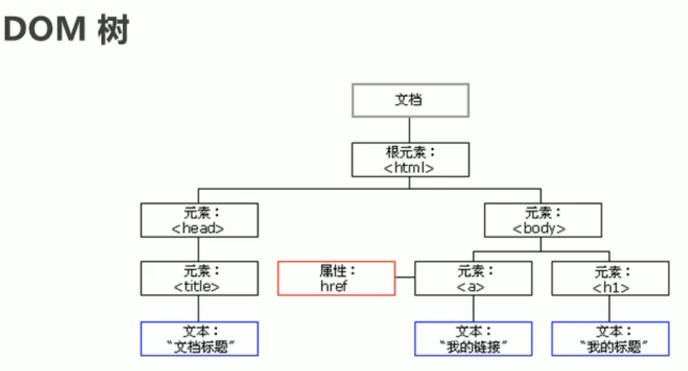
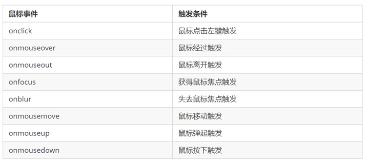

# DOM 的理解

* Web APIs 是 W3C 组织的标准；
* Web APIs 主要学习 DOM 和 BOM；
* Web APIs 是 JS 独有的部分，主要学习页面交互功能；

## 一、认识 DOM

Web API 是浏览器提供的一套操作 浏览器功能 和 页面元素 的API（BOM 和 DOM）。

文档对象模型（Document Object Model，简称 DOM），是W3C组织推荐的处理可扩展标记语言(HTML 或者 XML)的标准编程接口。

W3C 已经定义了一系列的 DOM 接口，通过这些 DOM 接口可以改变网页的内容、结构和样式。



- 文档：一个页面就是一个文档，DOM中使用document表示；
- 元素：页面中所有标签都是元素，DOM中使用 element 表示；
- 节点：页面中所有内容都是节点（标签、属性、文本、注释等），DOM中使用node表示；
- DOM把以上内容都看作是对象。

## 二、获取元素 element

### 2.1、document.getElementById('id名称') 获取指定 element 对象

```javaScript
<div id="time">2022-12-27</div>

<script>
    var timeBox = document.getElementById('time');
    console.log(timeBox);
    console.log(typeof timeBox);
    console.dir(timeBox);		// 打印查看对象的详细信息
</script>
```

### 2.2、document.getElementsByTagName('标签名') 获取 element 对象伪数组

```javaScript
<ul>
	<li>aaa</li>
	<li>bbb</li>
	<li>ccc</li>
</ul>

<ul id="nav">
	<li>111</li>
	<li>222</li>
	<li>333</li>
</ul>

<script>
    var ls = document.getElementsByTagName('li');
    console.log(ls);    // 根据标签名获取DOM中的 element对象的伪数组
    
    // 区分选择部分
    var nav = document.getElementById('nav');
    var navLs = nav.getElementsByTagName('li');
    console.log(navLs);
</script>
```

### 2.3、通过HTML5新增的方法获取

#### 2.3.1、document.getElementsByClassName('class名称') 获取 Element 对象的伪数组

```javaScript
<div class="box"></div>
<div class="box"></div>
	
<script>
    var boxs = document.getElementsByClassName('box');
    console.log(boxs);
</script>
```

#### 2.3.2、document.querySelector('任何选择器（标签、ID、类选择器）') 获取匹配的第一个元素

根据 任何类型的选择器 查找DOM中的第一个符合的元素


```javaScript
<div class="box"></div>
<div id="nav">
	<ul>
		<li>首页</li>
		<li>产品</li>
	</ul>
</div>

<script>
    var box1 = document.querySelector('.box');
    console.log(box1);

    var nav = document.querySelector('#nav');
    console.log(nav);
    
    var li = document.querySelector('li');
    console.log(li);    // ⚠️：获取第一个li 首页
</script>
```

#### 2.3.3、document.querySelectorAll('任何选择器') 返回匹配的所有的元素

```javaScript
<div class="box"></div>
<div class="box"></div>
	
<script>
    var allBox = document.querySelectorAll('.box');
    console.log(allBox);
</script>
```

### 2.4、特殊元素(html、body)的获取

```javaScript
<script>
	// 1、获取body元素对象
	var bodyEle = document.body;
	console.log(bodyEle);
	console.dir(bodyEle);

	// 1、获取html元素对象
	var htmlEle = document.documentElement;
	console.log(htmlEle);

</script>
```

## 三、理解JS事件

* `JavaScript` 使我们有能力创建动态页面，而事件是可以被 `JavaScript` 侦测到的行为。

* 网页中的每个元素都可以产生某些可以触发 `JavaScript` 的事件。

* 事件是由三部分组成，也称为事件三要素：

    事件源：触发事件的元素
    事件类型：什么事件，例如 click 点击事件
    事件处理程序：事件触发后要执行的代码(函数形式)，事件处理函数


```javaScript
<button id="btn">弹窗</button>

<script>
    // 1、事件源
    var btn = document.getElementById('btn');
    // 2、事件类型，如何触发 什么事件 如：鼠标点击 onclick
    
    // 3、事件处理程序  通过一个函数赋值的方式 完成
    btn.onclick = function() {
        alert('我是弹窗');
    }
</script>
```

### 3.1、常见的鼠标事件




### 3.2、元素焦点控制

```html
<input type="text" name="" placeholder="请输入内容">
<button class="btn">输入</button>
<button class="btn">离开</button>
	
<script type="text/javascript">
	let input = document.querySelector('input');
	let btns = document.getElementsByClassName('btn');

	btns[0].onclick = function() {
		console.log('点击btn1 = ', input);
		input.focus()
	}
	btns[1].onclick = function() {
		console.log('点击btn2');
		input.blur();
	}

	input.onfocus = function() {
		console.log('监听到获取焦点');
	}
	input.onblur = function() {
		console.log('监听到失去焦点');
	}
</script>
```

