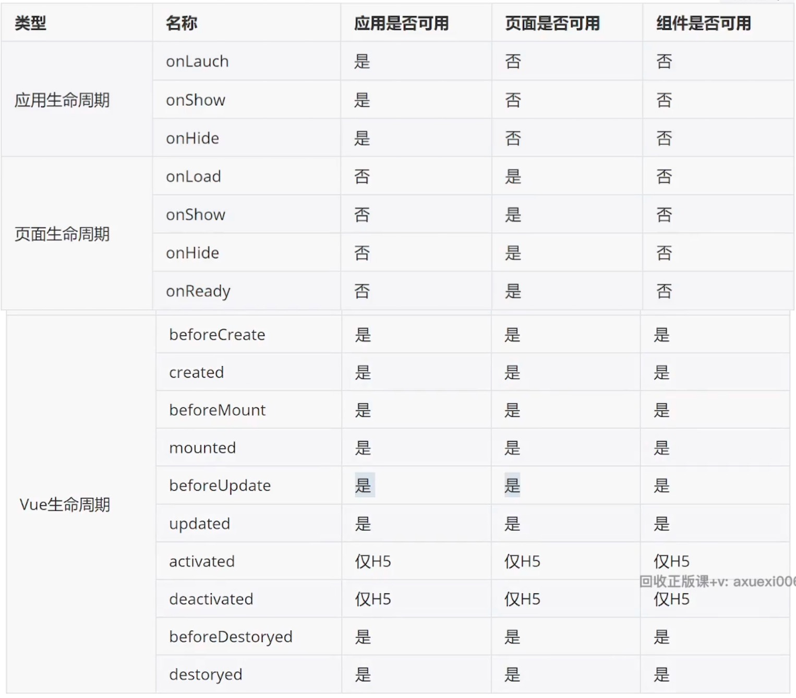

# 一、项目全局文件

## 1.1、uni.scss

uni-app 项目在运行时会自动将 uni.scss 会自动被注入到页面样式当中，根据这个特性可以在 uni.scss 中定义一些全局 SASS 变量，统一页面的样式风格，如主色调、边框圆角等。

* 在 uni.scss 中定义全局变量

sass 变量必须以 `$` 开头：

```css
/*在原有 sass 变量基础上添加新的变量 */
$uni-bg-color: #f4f4f4;
```

* 在 组件或者页面中使用 该变量
注意：style 标签需设置 lang="scss"，且在 uni-app 中不能使用 scoped。

```vue
<style lang="scss">
/* page 是原生小程序页面最外层的标签(虽然我们从未写过)，uni-app 中可以通过 page 标签选择器设置整个页面的背景 */
page {
  background-color: $uni-bg-color;
}
</style>
```

# 1.2、App.vue

在 Vue 项目中，App.vue 表示项目的根组件。
在 uni-app 中 App.vue 是一个特殊的文件，用于`定义应用的全局的入口`，相当于原生小程序的 `app.js+app.wxss`。主要作用是：
* 管理应用的生命周期;
* 添加每个页面公共 CSS，其中编写的 CSS 样式起到全局样式的作用;

# 1.3、pages.json
pages.json 文件即包含了小程序的【全局配置】也包含了【页面配置】，基本配置项如下：

* `pages` 对应的是【页面配置】
  `path` 指定页面的路径，`style` 为该路径的相关配置，如：背景色、导航栏等。

* `g1obalstyle` 对应【全局配置】的 `window`
  用来全局配置页面背景色、导航栏等

* `tabBar` 配置底部标签栏
  注意配置 tabBar 时，设置图片，图标位置必须放在 `src/static` 目录下，否则找不到图片。

* `subPackages` 分包


# 二、组件

## 2.1、内置组件

uni-app 把微信小程序的内置组件都做了重新实现，保证能够在不同的平台表现尽量一致，因此在学习使用uni
app 的组件时，只需要参照微信小程序内置组件即可。


## 2.2、uni ui 组件库
在 uni-app 中的扩展组件(uni ui)大多是一些业务性与交互性比较强的组件，比如倒计时组件、日历组件、文件
上传等，扩展组件是需要下载到项目录目录中才可以使用。

## 2.3、uView UI 组件库

插件市场也有许多第三方的优秀组件库，如 uView(不支持 Vue3)，可使用 `uview-plus`。


# 三、生命周期
在 `uni-app` 中生命周期 和 `微信小程序` 一样也分成 3个类别，分别是：应用级生命周期、页面级生命周期 和 组件级生命周期，其支持情况可见下表:



当然上表是不需要大家死记硬背的，大家记这样一个原则即可：

【应用生命周期】和【页面生命周期】采用小程序的生命期，自定义【组件生命周期】使用 Vue 的生命周期；
结合 Vue3 的 setup 语法使用【应用生命周期】和【页面生命周期】需要用到 `@dcloudio/uni-app` 包。

```ts
<script setup>
// vue 组件生命周期
import { onMounted } from 'vue'

// ---- 应用、页面生命周期  等价于  原生小程序中的生命周期

// 应用生命周期
import { onLaunch, onShow, onHide } from '@dcloudio/uni-app';
// 页面生命周期
import { onLoad, onShow, onHide, onReady } from '@dcloudio/uni-app';

</script>
```


# 四、API调用

## 4.1、命名空间
uni-app 把微信小程序绝大部分的 API 做了重新实现，使其尽量能在不同的平台(H5的限制比较多)中使用，所不同的是在调用这些 API 时，需要将命名空间换成 uni，举例来说明，原来的调用方法为 `wx.request` 在 `uni-app` 中则换成 `uni.request` 即可.


## 4.2、Promise
在原生小程序中有部分的 API 是不支持 `Promise` 的，比如 `wx.request、wx.uploadFi1e` 等，在 `uni-app` 中对这些 API 的调用方法做了规订，使其即能支持 Promise 也可以支持 callback 方式，它是这样规定的:

1、在调用 API 时，传入 success、 fail、complete 任意回调函数，即为 callback 方式；callback 方式不返回 Promise。
2、在调用 API 时，没有传入任意回调函数，即为 Promise 方式；返回值为 Promise 时方便配置 async/wait 来获取结果。

# 五、条件编译
uni-app 目标是通过编写一套代码，实现跨端的开发，但是不同的平台之间存在的差异也是事实，很难做到完全一套代码在各个平台都能够兼容，比如 uni.1ogin 这个 API 在 H5 平台就无法被支持，再比如 keep-alive 只能用在 H5端。

为了解决平台的差异性，特殊情况下需要为不同平台编写合适的代码，且要保证这些代码只在某个的平台下运行uni-app 提供了条件编译的技术解决方案。
