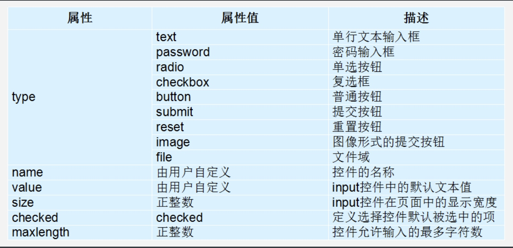

# 列表

- 概念：

  容器里面装载着结构，样式一致的文字或图表的一种形式，叫列表

- 特点：

  列表最大的特点就是  整齐、整洁、 有序，跟表格类似，但是他可组合自由度会更高。
  
  表格是用来显示数据的，列表就是用来布局的。 因为非常整齐和自由
  
## 无序列表 ul

无序列表的各个列表项之间没有顺序级别之分，是并列的。其基本语法格式如下：

```
<ul>
  <li>列表项1</li>
  <li>列表项2</li>
  <li>列表项3</li>
  ......
</ul>
```

 1. `<ul></ul>`中只能嵌套`<li></li>`，直接在`<ul></ul>`标签中输入其他标签或者文字的做法是不被允许的。
 2. `<li>与</li>`之间相当于一个容器，可以容纳所有元素。
 3. 无序列表会带有自己样式属性，放下那个样式，让CSS来装饰。

## 有序列表 ol
 
有序列表即为有排列顺序的列表，其各个列表项按照一定的顺序排列定义，有序列表的基本语法格式如下：

```
<ol>
  <li>列表项1</li>
  <li>列表项2</li>
  <li>列表项3</li>
  ......
</ol>
``` 

所有特性基本与ul 一致。  但是实际中比 无序列表 用的少很多。

## 自定义列表 dl

定义列表常用于对术语或名词进行解释和描述，定义列表的列表项前没有任何项目符号。其基本语法如下：

```
<dl>
  <dt>名词1</dt>
  <dd>名词1解释1</dd>
  <dd>名词1解释2</dd>
  ...
  <dt>名词2</dt>
  <dd>名词2解释1</dd>
  <dd>名词2解释2</dd>
  ...
</dl>
```


```
<!-- 无序列表 ul  -->
<ul>
	<li>苹果又发布新产品了</li>
	<li>旅游旺季你想干嘛</li>
	<li>国内消费增长态势良好</li>
</ul>

<!-- 有序列表 ol  -->
<ol>
	<li>冠军</li>
	<li>季军</li>
	<li>亚军</li>
</ol>

<!-- 自定义列表 dl -->
<dl>
	<dt>帮助中心</dt>
	<dd>用户管理</dd>
	<dd>购物指南</dd>
	<dd>订单操作</dd>

	<dt>关于我们</dt>
	<dd>了解我们</dd>
	<dd>加入我们</dd>
	<dd>联系我们</dd>
</dl>
```


# 表单

表单目的是为了收集用户信息。

在我们网页中， 我们也需要跟用户进行交互，收集用户资料，此时也需要表单。

> 在HTML中，一个完整的表单通常由表单控件（也称为表单元素）、提示信息和表单域3个部分构成。

**表单控件：** 包含了具体的表单功能项，如单行文本输入框、密码输入框、复选框、提交按钮、重置按钮等。

**提示信息：** 一个表单中通常还需要包含一些说明性的文字，提示用户进行填写和操作。

**表单域：**  他相当于一个容器，用来容纳所有的表单控件和提示信息，可以通过他定义处理表单数据所用程序的url地址，以及数据提交到服务器的方法。如果不定义表单域，表单中的数据就无法传送到后台服务器。

## input 表单控件

基本语法格式如下：

```
<input type="属性值" value="你好">
```

常用属性：


* `name` 属性，表单的名字，后台可以通过这个name属性找到某个表单。当有多个表单类型为选按钮时，指定它们相同的`name`，这样就可以多个选其中的一个。

### label标签

`label`标签用于绑定一个表单元素, 当点击`label`标签的时候, 被绑定的表单元素就会获得输入焦点。

`label`标签有两种方式绑定表单元素：

1. 第一种用法就是用label直接包括input表单。适合单个表单选择

基本语法格式如下：

```
<label> 用户名： <input type="radio" name="usename" value="请输入用户名">   </label>
```

2. 第二种用法 `for` 属性规定 `label` 与哪个表单元素绑定。

基本语法格式如下：

```
<label for="sex">男</label>
<input type="radio" name="sex"  id="sex">
```

## textarea控件(文本域)

通过`textarea`控件可以轻松地创建多行文本输入框.

cols="每行中的字符数" rows="显示的行数"  我们实际开发不用。

基本语法格式如下：

```
<textarea >
  文本内容
</textarea>
```

## select下拉列表

基本语法格式如下：

```
<select>
  <option>选项1</option>
  <option>选项2</option>
  <option>选项3</option>
  ...
</select>
```

1. `<select>`中至少包含一对 `option` 
2. 在 `option` 中定义 `selected ="selected"` 时，当前项即为默认选中项。
3. 但是我们实际开发会用的比较少。

## form表单域

在`HTML`中，`form`标签被用于定义表单域，以实现用户信息的收集和传递，`form`中的所有内容都会被提交给服务器。

基本语法格式如下：

```
<form action="url地址" method="提交方式" name="表单名称">
  各种表单控件
</form>
```

* `action="url地址"` 用于指定接收并处理表单数据的服务器程序的url地址。

*  `method="get/post"` 用于设置表单数据的提交方式，其取值为get或post。

*  `name="表单名称"` 用于指定表单的名称，以区分同一个页面中的多个表单。

```
<form action="" method="post" name="user">
	用户名: <input type="text" name="username" /> <br />
	密码: <input type="password" name="pwd" /><br />
	<input type="submit" />
	<input type="reset" />
</form>
```

**注意:**  

每个表单都应该有自己表单域。我们现在做页面，不写看不到效果，但是 如果后面学 `ajax` 后台交互的时候，必须需要 `form表单域`。


