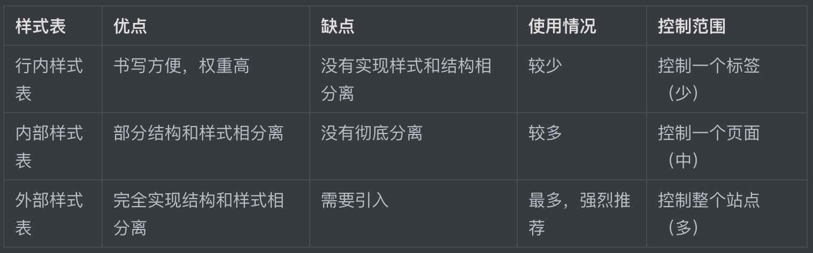

# 认识CSS

`HTML` 只关注内容的语义，满足不了设计者的需求。

如果直接在 `HTML` 里面添加样式带来的是无尽的臃肿和繁琐，所以需要借助 `CSS`。

> CSS的最大贡献就是：让 HTML 从样式中脱离，实现了 HTML 专注去做 结构呈现，样式交给css。
> 
> 我们理想中的结果： 结构(html)与样式(css)相分离。


**CSS(Cascading Style Sheets)**，通常称为`CSS`样式表或层叠样式表（级联样式表）。

CSS的作用：

- 主要用于**设置** HTML页面中的文本内容（字体、大小、对齐方式等）、图片的外形（宽高、边框样式、边距等）以及**版面的布局和外观显示样式。**

- CSS以HTML为基础，提供了丰富的功能，如字体、颜色、背景的控制及整体排版等，而且还可以针对不同的浏览器设置不同的样式。

注意：
HTML永远是最重要的，如果结构写的不对，样式再怎么调整都是错的。

## 引入CSS样式表（书写位置）

### 行内式（内联样式）

- 概念：

    称行内样式、行间样式.

    是通过标签的style属性来设置元素的样式


- 其基本语法格式如下：

```
<标签名 style="属性1: 属性值1; 属性2: 属性值2; 属性3: 属性值3;"> 内容 </标签名>
```

例如：

```
<div style="color: red; font-size: 12px;">明日复明日，明日何其多</div>
```

实际上任何`HTML`标签都拥有**style属性**，用来设置行内式。

**行内式的特点：**

* 行内式多组属性值之间用逗号`;`隔开。

* 行内式只能控制当前的标签和以及嵌套在其中的子标签，造成代码冗余
 
* 行内式没有实现样式和结构相分离


### 内部样式表（内嵌样式表）

**称内嵌式**，是将`CSS`代码集中写在 HTML文档 的 `head头部标签` 中，并且用 `style标签` 定义。

其语法格式如下：

```
<head>
<style type="text/CSS">
    选择器 { 
      属性1: 属性值1;
      属性2: 属性值2; 
      属性3: 属性值3;
    }
</style>
</head>
```

**选择器 用来选择标签，给标签添加CSS样式。**

例如：

```
<style>
	 div {
	 	color: red;
	 	font-size: 12px;
	 }
</style>
```

**内部样式表的特点：**

* `style` 标签一般位于`head标签`中，当然理论上他可以放在`HTML文档`的任何地方。

* `type="text/css"`  在`html5`中可以省略。

* 只能控制当前的页面，没有彻底分离。

### 外部样式表（外链式）

又称链入式，是将所有的样式放在一个或多个以 `.CSS` 为扩展名的外部样式表文件中，通过`link标签`将外部样式表文件链接到`HTML文档`中。

其语法格式如下：

1、在 HTML 文件中链接外部样式表文件

```
<head>
  <link rel="stylesheet" type="text/css" href="css文件路径">
</head>
```

`link标签` 需要放在 `head头部标签` 中，并且指定 `link标签` 的三个属性。

* **rel**，定义当前文档与被链接文档之间的关系，在这里需要指定为 `“stylesheet”`，表示被链接的文档是一个样式表文件。

* **type**，定义所链接文档的类型，在这里需要指定为“text/CSS”，表示链接的外部文件为CSS样式表。我们都可以省略。

* **href**，定义所链接外部样式表文件的URL，可以是相对路径，也可以是绝对路径。

2、直接在以**.CSS**为扩展名的外部样式表文件中书写CSS样式

```
div {
	color: green;
	font-size: 25px;
}
```


## CSS 三种样式表总结



## 书写CSS样式代码风格

样式书写一般有两种：

- 一种是紧凑格式 (Compact)
```
h3 { color: deeppink;font-size: 20px;}
```

- 一种是展开格式（推荐）

```
h3 {
    color: deeppink;
    font-size: 20px;    
}
```

样式选择器，属性名，属性值关键字全部使用小写字母书写，属性字符串允许使用大小写。

