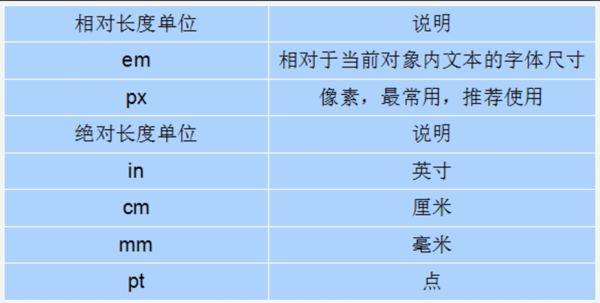
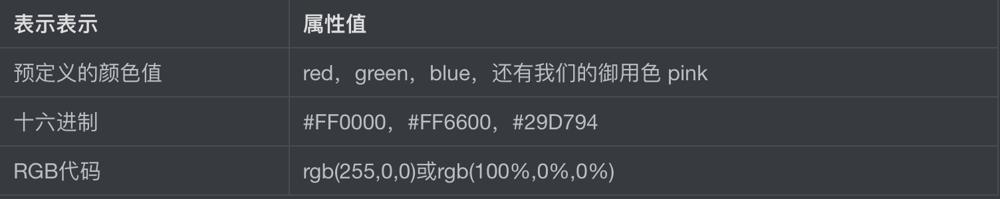
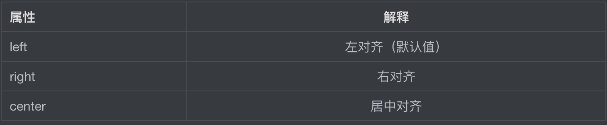
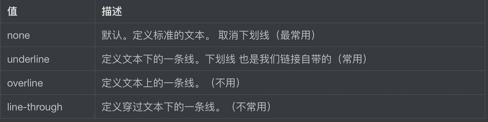

# CSS文字文本样式

## font字体

### font-size:大小

**单位：**

- 可以使用相对长度单位，也可以使用绝对长度单位。

- 相对长度单位比较常用，推荐使用像素单位px，绝对长度单位使用较少。



* 开发中文字大小以后基本就用px了，其他单位很少使用

* 谷歌浏览器默认的文字大小为16px

* 但是不同浏览器可能默认显示的字号大小不一致，我们尽量给一个明确值大小，不要默认大小。一般给body指定整个页面文字的大小。

### font-family:字体

- 网页中常用的字体有宋体、微软雅黑、黑体等，例如将网页中所有段落文本的字体设置为微软雅黑

- 可以同时指定多个字体，中间以**英文逗号**隔开，表示如果浏览器不支持第一个字体，则会尝试下一个，直到找到合适的字体， 如果都没有，则以我们电脑默认的字体为准。

**web中使用字体注意点：**

1. 各种字体之间必须使用英文状态下的逗号隔开。
2. 中文字体需要加英文状态下的引号，英文字体一般不需要加引号。当需要设置英文字体时，英文字体名必须位于中文字体名之前。
3. 如果字体名中包含`空格、#、$`等符号，则该字体必须加英文状态下的单引号或双引号，例如font-family: "Times New Roman";。
4. 尽量使用系统默认字体，保证在任何用户的浏览器中都能正确显示。

```
p { 
    font-family: Arial,"Microsoft Yahei", "微软雅黑";
}
```

#### CSS Unicode字体

- 为什么使用 Unicode字体

  - 在 CSS 中设置字体名称，直接写中文是可以的。但是在文件编码（GB2312、UTF-8 等）不匹配时会产生乱码的错误。
  - xp 系统不支持 类似微软雅黑的中文。

- 解决：

  - 方案一： 你可以使用英文来替代。 比如` font-family:"Microsoft Yahei"`。

  - 方案二： 在 CSS 直接使用 Unicode 编码来写字体名称可以避免这些错误。使用 Unicode 写中文字体名称，浏览器是可以正确的解析的。

| 字体名称    | 英文名称        | Unicode 编码         |
| ----------- | --------------- | -------------------- |
| 宋体        | SimSun          | \5B8B\4F53           |
| 新宋体      | NSimSun         | \65B0\5B8B\4F53      |
| 黑体        | SimHei          | \9ED1\4F53           |
| 微软雅黑    | Microsoft YaHei | \5FAE\8F6F\96C5\9ED1 |
| 楷体_GB2312 | KaiTi_GB2312    | \6977\4F53_GB2312    |
| 隶书        | LiSu            | \96B6\4E66           |
| 幼园        | YouYuan         | \5E7C\5706           |
| 华文细黑    | STXihei         | \534E\6587\7EC6\9ED1 |
| 细明体      | MingLiU         | \7EC6\660E\4F53      |
| 新细明体    | PMingLiU        | \65B0\7EC6\660E\4F53 |


### font-weight:字体粗细

在html中将字体加粗可以用 标签(`b 和 strong`)来实现。当使用CSS来实现，但是CSS是没有语义的。

```
p {
    font-weight: 700;
}
```

| 属性值  | 描述                                                      |
| ------- | :-------------------------------------------------------- |
| normal  | 默认值（不加粗的）                                        |
| bold    | 定义粗体（加粗的）                                        |
| 100~900 | 400 等同于 normal，而 700 等同于 bold  我们重点记住这句话 |

**开发中更喜欢用数字来表示加粗和不加粗。**

### font-style:字体风格

在html中可以用标签（ `i  和 em` ）来将字体倾斜。使用CSS 来实现，但是CSS 是没有语义的。

```
p {
    font-style: normal;
}
```

| 属性   | 作用                                                    |
| ------ | :------------------------------------------------------ |
| normal | 默认值，浏览器会显示标准的字体样式  font-style: normal; |
| italic | 浏览器会显示斜体的字体样式。                            |


* 开发中很少给文字加斜体，反而喜欢给斜体标签（em，i）改为普通模式。

### font:综合设置字体样式

```
<style>
    .font {
			font-weight: 400;
			font-style: italic;
			font-size: 18px;
			font-family: "Microsoft YaHei";
		}
</style>
```

我们可以按上面的属性来依次设置字体样式，也可以用`font`属性对字体样式进行综合设置

```
选择器 { font: font-style  font-weight  font-size/line-height  font-family;}
```

* 使用font属性时，必须按上面语法格式中的顺序书写，**不能更换顺序**，各个属性以**空格**隔开。

* 其中不需要设置的属性可以省略（取默认值），但**必须保留font-size和font-family属性**，否则font属性将不起作。


## CSS外观属性

### color:文本颜色

CSS中 `color` 属性用于定义文本的颜色。



开发中，用 16进制的写法是最多的，而且我们更喜欢简写方式比如  #f00 代表红色。

### text-align:文本水平对齐方式

CSS中 `text-align` 属性用于设置文本内容的水平对齐，相当于html中的align对齐属性。

**`text-align`属性的作用是让盒子里面的内容水平居中， 而不是让盒子居中对齐。**

其属性值如下：


### line-height:行间距

CSS中 `line-height`属性用于设置行间距，就是行与行之间的距离，即字符的垂直间距，一般称为行高。

* line-height常用的属性值单位有三种，分别为像素px，相对值em和百分比%，实际工作中使用最多的是像素px。

* 一般情况下，**行距比字号大7、8像素左右就可以了**。


### text-indent:首行缩进

CSS中 `text-indent`属性用于设置首行文本的缩进。

- 其属性值可为不同单位的数值、em字符宽度的倍数、或相对于浏览器窗口宽度的百分比%，允许使用负值。
- 建议使用em作为设置单位。

**1em 就是一个字的宽度   如果是汉字的段落， 1em 就是一个汉字的宽度**

### text-decoration 文本的装饰

CSS中 `text-decoration`属性通常我们用于给链接修改装饰效果。




### CSS外观属性总结

| 属性            | 表示     | 注意点                                                  |
| :-------------- | :------- | :------------------------------------------------------ |
| color           | 颜色     | 我们通常用  十六进制   比如 而且是简写形式 #fff         |
| line-height     | 行高     | 控制行与行之间的距离                                    |
| text-align      | 水平对齐 | 可以设定文字水平的对齐方式                              |
| text-indent     | 首行缩进 | 通常我们用于段落首行缩进2个字的距离   text-indent: 2em; |
| text-decoration | 文本修饰 | 记住 添加 下划线  underline  取消下划线  none           |


## emmet语法

Emmet的前身是Zen coding,它使用缩写,来提高html/css的编写速度。[emment语法](https://www.w3cplus.com/tools/emmet-cheat-sheet.html)

1. 生成标签 直接输入标签名 按tab键即可   比如  div   然后tab 键， 就可以生成 `<div></div>`

2. 如果想要生成多个相同标签  加上 * 就可以了 比如   div*3  就可以快速生成3个div

3. 如果有父子级关系的标签，可以用 >  比如   ul > li就可以了

4. 如果有兄弟关系的标签，用  +  就可以了 比如 div+p  

5. 如果生成带有类名或者id名字的，  直接写  .demo  或者  #two   tab 键就可以了

6. 如果生成的div 类名是有顺序的， 可以用 自增符号  $     

