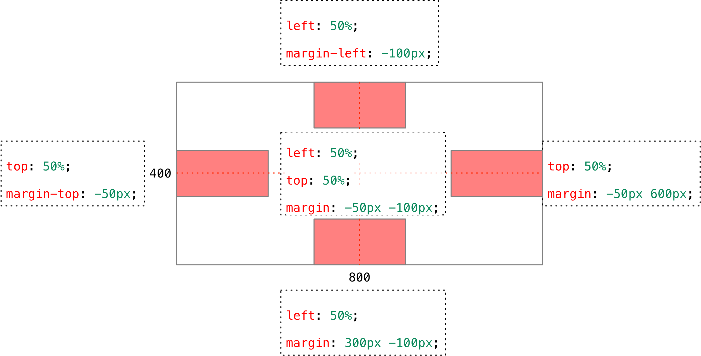

# 定位

## 一、CSS布局的三种机制

> 网页布局的核心 —— 就是**用 CSS 来摆放盒子位置**。

`CSS` 提供了 3 种机制来设置盒子的摆放位置，分别是普通流、浮动和定位，其中：

1. 普通流（标准流），
    * 可以让盒子上下排列 或者 左右排列的

2. 浮动
    * 让盒子从普通流中**浮**起来 —— **让多个盒子(div)水平排列成一行**，或者 左右对齐盒子。

3. 定位
    * 将盒子**定**在某一个**位**置 自由的漂浮在其他盒子的上面 —— CSS 离不开定位，特别是后面的 js 特效。
    * 定位最大的特点是有**层叠**的概念，就是可以让多个盒子 前后 叠压来显示。 但是每个盒子需要测量数值。

### 为什么使用定位

网页中很多时候需要实现以下一些效果：

1、在某个盒子上方添加一个标签图标元素，并且标签图标元素可以随便任意摆放位置。

2、在网页文档的左边、头部、右边，固定一个工具栏、导航栏，使它们在网页上下滚动时保持位置不变。

思考发现，目前的 标准流 和 浮动 都无法实现此类效果。这时就需要用到 **定位**：

> 将盒子**定**在某一个**位**置 自由的**漂浮**在其他盒子(包括标准流和浮动)的上面

对于三种布局机制（标准流、浮动、定位），可以用下面的这种方式去理解：

```
标准流在最底层 (海底) ------- 浮动 的盒子 在 中间层 (海面) ------- 定位的盒子 在 最上层 （天空）
```

## 二、定位的概念与使用

### 1、边偏移

简单说，**定位的盒子是通过边偏移来移动位置的**。

在 `CSS` 中，通过 `top`、`bottom`、`left` 和 `right` 属性定义元素的**边偏移**：（方位名词）

| 边偏移属性 | 示例           | 描述                                                     |
| ---------- | :------------- | -------------------------------------------------------- |
| `top`      | `top: 80px`    | **顶端**偏移量，定义元素相对于其父元素**上边线的距离**。 |
| `bottom`   | `bottom: 80px` | **底部**偏移量，定义元素相对于其父元素**下边线的距离**。 |
| `left`     | `left: 80px`   | **左侧**偏移量，定义元素相对于其父元素**左边线的距离**。 |
| `right`    | `right: 80px`  | **右侧**偏移量，定义元素相对于其父元素**右边线的距离**   |

定位的盒子有了边偏移才有价值。 一般情况下，凡是有定位地方必定有边偏移。

### 2、定位模式 `position`

在 `CSS` 中，通过 `position` 属性定义元素的**定位模式**，语法如下：

```css
选择器 { position: 属性值; }
```
定位模式是有不同分类的，在不同情况下，我们用到不同的定位模式。
| 值         |     语义     |
| ---------- | :----------: |
| `static`   | **静态**定位 |
| `relative` | **相对**定位 |
| `absolute` | **绝对**定位 |
| `fixed`    | **固定**定位 |

> **定位 = 定位模式(`position`) + 边偏移**

### 3.1、静态定位 `static`

静态定位是元素的默认定位方式，无定位的意思。它相当于 border 里面的none， 不要定位的时候用。几乎不用。

```css
<style type="text/css">
	.box {
		position: static;
	}
</style>
```

### 3.2、相对定位 `relative`

> **相对定位**是元素相对于它 原来在标准流中的位置 来说的。（自恋型）

如下示例，给 `box2` 设置相对定位，它依然占有位置，只是相对于它原来的位置进行偏移。

```html
<style type="text/css">
	.box1 {
		background-color: red;
	}
	.box2 {
		background-color: pink;
		/*相对定位*/
		position: relative;
		left: 100px;
		top: 50px;
	}
	.box3 {
		background-color: skyblue;
	}
</style>

<div class="box1"></div>
<div class="box2"></div>
<div class="box3"></div>
```

**相对定位的特点**：（务必记住）

* 相对于 自己原来在标准流中位置来移动的

* 原来在标准流的区域继续占有，后面的盒子仍然以标准流的方式对待它。

### 3.3、绝对定位 `absolute`

**绝对定位** 是元素以**带有定位的父级元素**来移动位置 （拼爹型（即父级））

1、绝对定位**完全脱标** —— 完全不占位置；

2、**父元素没有定位**，则以浏览器（即：Document 文档）为准定位。

3、**父元素有定位**，将元素依据最近的已经定位（`绝对、固定或相对定位`）的父元素（祖先）进行定位。

```html
<div class="father">
	<div class="son son1"></div>
	<div class="son son2"></div>
</div>

<style type="text/css">
		.father {
		width: 200px;
		height: 200px;
		background-color: pink;
		margin: 0 auto;
		/*如果不给父级别设置定位，则盒子son1相对于html文档定位*/
		position: relative;
	}
	.son {
		width: 90px;
		height: 90px;
		background-color: skyblue;
	}
	.son1 {
	   /*给子级设置绝对定位*/
		position: absolute;
		right: 0;
		bottom: 0;
	}
	.son2 {
		height: 100px;
		background-color: green;
	}
</style>
```

#### 定位口诀 —— 子绝父相

**因为绝对定位的盒子是拼爹的，所以要和父级搭配一起来使用**。

子绝父相 —— 子级是绝对定位，父级要用相对定位。

子绝父相是使用绝对定位的口诀，要牢牢记住！
疑问：为什么在布局时，子级元素使用绝对定位时，父级元素就要用相对定位呢？

> 结论：父级要占有位置，子级要任意摆放，这就是子绝父相的由来。


### 3.4、固定定位 fixed - 重要

固定定位是绝对定位的一种特殊形式： （认死理型） 如果说绝对定位是一个矩形 那么 固定定位就类似于正方形

```html
<style type="text/css">
    .box {
        position: fixed;
    }
</style>
```

**固定定位的特点：**

* 完全脱标 —— 完全不占位置；

* **只认浏览器的可视窗口** —— 浏览器可视窗口 + 边偏移属性 来设置元素的位置；

* 跟父元素没有任何关系；单独使用的

* 不随滚动条滚动。

> 提示：IE 6 等低版本浏览器不支持固定定位。

## 三、定位(position)的扩展

### 1、绝对定位的盒子居中

**绝对定位/固定定位**的盒子是无法通过设置 `margin: auto` 设置水平居中。如下代码所示：

```html
<style type="text/css">
	.box {
		width: 100px;
		height: 100px;
		background-color: pink;
		position: relative;
	}
	.tag {
		width: 60px;
		height: 25px;
		background-color: red;
		position: absolute;
		/*由于是绝对定位盒子，无法通过 margin: 0 auto 设置其水平居中*/
		margin: 0 auto;
	}
</style>
	
<div class="box">
	<div class="tag"></div>
</div>
```

在使用绝对定位时要想实现水平居中可以使用如下方式：

```html
<style type="text/css">
  .tag {
		width: 60px;
		height: 25px;
		background-color: red;
		position: absolute;
		/*设置左方向的边偏移为父盒子宽度的一半*/
		left: 50%;
		/*设置其左外边距为其宽度的一半*/
		margin-left: -30px;
	}
</style>
```

* `left: 50%;`：让盒子的左侧移动到父级元素的水平中心位置；

* `margin-left: -30px;`：让盒子向左移动自身宽度的一半。

当然可以通过 `边偏移` + `外边距` 设置盒子任意方向的对齐，如下所示：



 
### 2、盒子堆叠顺序（z-index）

使用 相对`relative`、绝对`absolute`、固定`fixed` 定位盒子时，会出现盒子之间相互重叠的情况。

定位盒子默认**后来者居上**， 后面的盒子会压住前面的盒子。

```html
<style type="text/css">
	.box-z1,
	.box-z2,
	.box-z3 {
		width: 100px;
		height: 100px;
		background-color: red;
		position: absolute;
		/*z-index: 2;*/
	}
	.box-z2 {
		background-color: blue;
		top: 50px;
		left: 50px;
		/*z-index: 3;*/
	}
	.box-z3 {
		background-color: green;
		top: 100px;
		left: 100px;
		/*z-index: 1;*/
	}
</style>

<div class="box-z1"></div>
<div class="box-z2"></div>
<div class="box-z3"></div>
```

`z-index` 层叠等级属性可以调整盒子的堆叠顺序，其特点如下：

1. 属性值：正整数、负整数或 0；默认值是 0，数值越大，盒子越靠上；

2. 如果属性值相同，则按照书写顺序，后来居上；

3. 数字后面不能加单位。
    注意：`z-index` 只能应用于相对定位、绝对定位和固定定位的元素，其他标准流、浮动和静态定位无效。

### 3、定位盒子的显示模式 display

`display` 是 显示模式，可以改变显示模式有以下方式:

1. 可以用 `inline-block` 转换为行内块

2. 可以用浮动 `float` 默认转换为**行内块**（类似，并不完全一样，因为浮动是脱标的）

3. **绝对定位和固定定位也和浮动类似， 默认转换的特性 转换为行内块。**

> 一个行内的盒子，如果加了浮动、固定定位和绝对定位，不用转换，就可以给这个盒子直接设置宽度和高度等。
> 
> 浮动元素、绝对定位(固定定位）元素的都不会触发外边距合并的问题。 （我们以前是用padding border overflow解决的）

## 四、定位小结

| 定位模式         | 是否脱标占有位置     | 移动位置基准           | 模式转换（行内块） | 使用情况                 |
| ---------------- | -------------------- | :--------------------- | ------------------ | ------------------------ |
| 静态static       | 不脱标，正常模式     | 正常模式               | 不能               | 几乎不用                 |
| 相对定位relative | 不脱标，占有位置     | 相对自身位置移动       | 不能               | 基本单独使用             |
| 绝对定位absolute | 完全脱标，不占有位置 | 相对于定位父级移动位置 | 能                 | 要和定位父级元素搭配使用 |
| 固定定位fixed    | 完全脱标，不占有位置 | 相对于浏览器移动位置   | 能                 | 单独使用，不需要父级     |

**注意**：

1. **边偏移**需要和**定位模式**联合使用，**单独使用无效**；
2. `top` 和 `bottom` 不要同时使用；
3. `left` 和 `right` 不要同时使用。


