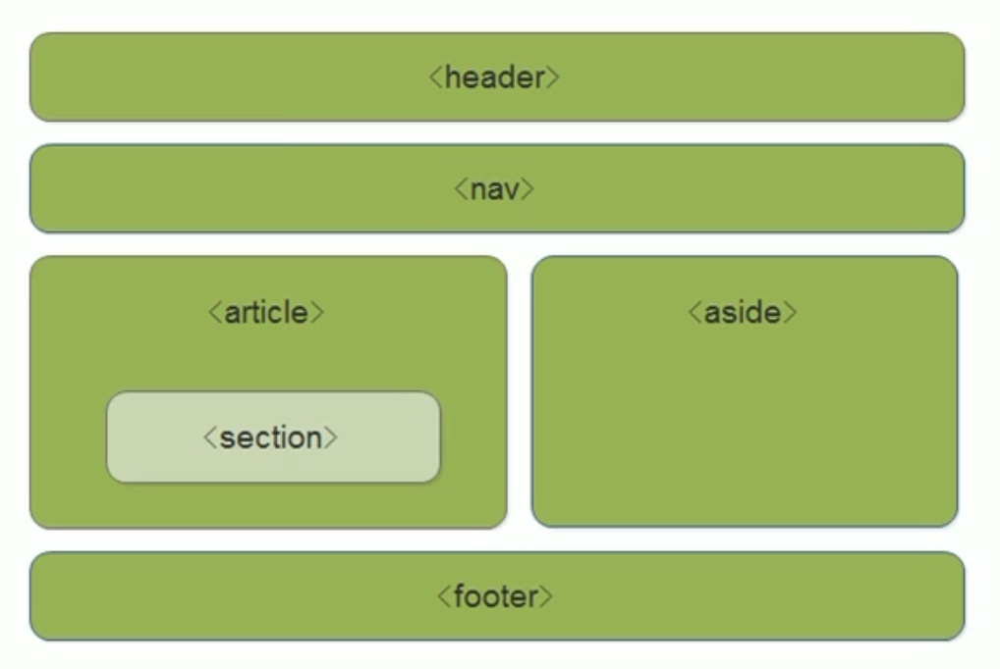
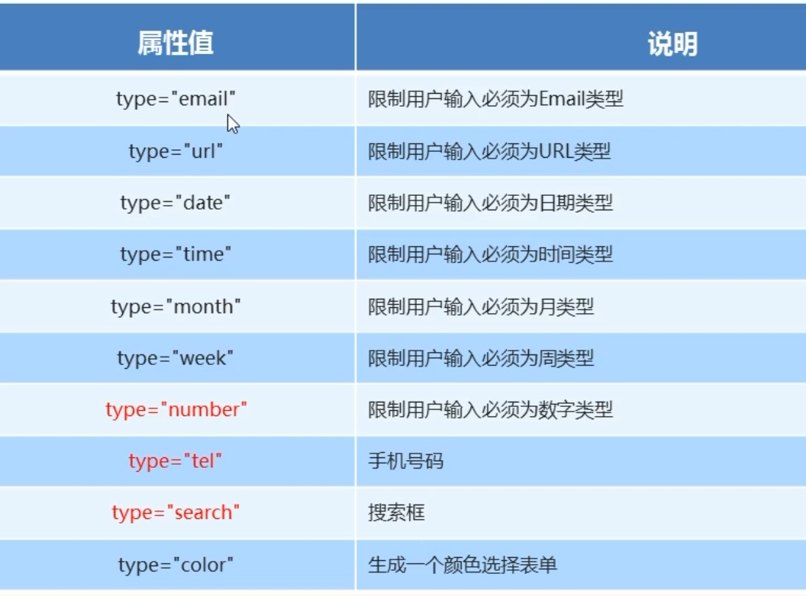
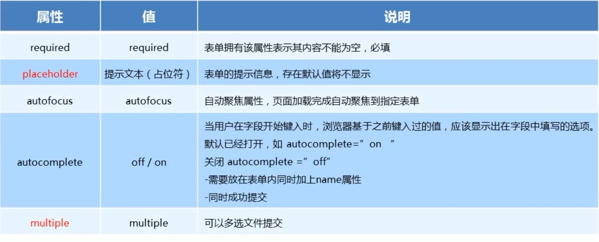

# html5标签

## 一、了解html5

### HTML5的概念

* 定义：
HTML5 定义了 HTML 标准的最新版本，是对 HTML 的第五次重大修改，号称下一代的 HTML

* 两个概念：
    是一个新版本的 HTML 语言，定义了新的标签、特性和属性
    拥有一个强大的技术集，这些技术集是指： HTML5 、CSS3 、javascript, 这也是广义上的 HTML5。
    
HTML5 的绝对多数新的属性，都已经被浏览器所支持，最新版本的浏览器已经开始陆续支持最新的特性，总的来说：HTML5 已经是大势所趋

### HTML5 拓展了哪些内容

* 语义化标签
* 本地存储
* 兼容特性
* 2D、3D
* 动画、过渡
* CSS3 特性
* 性能与集成

## 二、HTML5 新增标签

### HTML5 新增语义化标签

对于以前布局基本上使用 `div` 来做，而 `div` 对于搜索引擎来说是没有语义的，通常结构如下：

```html
<body>
    <div class="header"></div>
    <div class="nav"></div>
    <div class="content"></div>
    <div class="footer"></div>
</body>
```

`HTML5` 新增的语义化标签：

```html
<header>头部标签</header>

<nav>导航标签</nav>

<article>内容标签</article>

<section>块级标签</section>     使用section替代之前的div

<aside>侧边栏标签</aside>

<footer>尾部标签</footer>
```




- 语义化标签主要针对搜索引擎
- 新标签可以使用一次或者多次
- 在 `IE9` 浏览器中，需要把语义化标签都转换为块级元素
- 语义化标签，在移动端支持比较友好，
- 另外，`HTML5` 新增的了很多的语义化标签，随着课程深入，还会学习到其他的


### 多媒体标签

### H5新增input表单、表单属性




