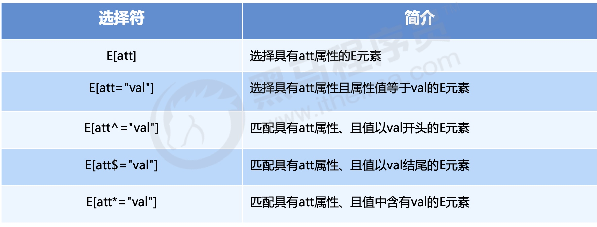
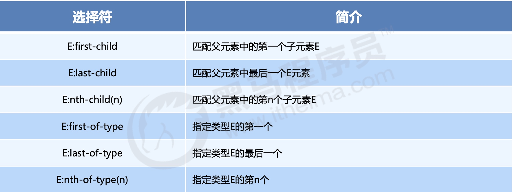
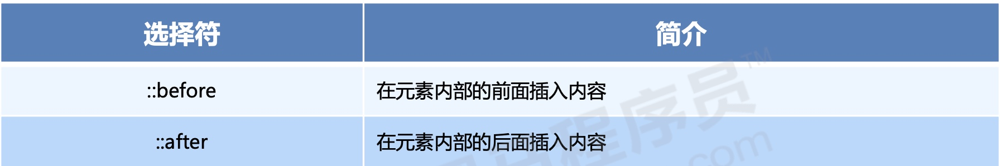

# CSS3 选择器 

## 一、CSS3 属性选择器 

> 类选择器、属性选择器、伪类选择器，权重为 10




```html
<style>
    /* 选择具有 disabled 属性的 button 元素，并改变其鼠标样式 */
    button[disabled] {
        cursor: default;
    }
    button {
        cursor: pointer;
    }
</style>

<button>按钮</button>
<!-- disabled 是禁用我们的按钮 -->
<button disabled="disabled">按钮</button>
```

```html
 <style>
    /* 2. 选择属性等于 search 的input元素 */  
    input[type="search"] {
        color: pink;
    }
    /* 3. 以某个值开头的 属性值 */
    div[class^="icon"] {
        color: red;
    }
    /* 4. 以某个值结尾的 */
    div[class$="icon"] {
        color: green;
    }
    /* 5. 可以在任意位置的 */
    div[class*="icon"] {
        color: blue;
    }
</style>

<input type="text" name="" id="" value="文本框">
<input type="search" name="" id="" value="搜索框">
<div class="icon1">图标1</div>
<div class="iicon3">图标2</div>
<div class="absicon">图标3</div>
```

## 二、CSS3 结构伪类选择器



```html
<style>
    /*选择父元素 ul 中的第一个子元素li*/
    ul li:first-child {
        background-color: pink;
    }
    /*选择父元素 ul 中的最后一个子元素li*/
    ul li:last-child {
        background-color: deeppink;
    }
    /* nth-child(n)  我们要第几个，n就是几  比如我们选第8个， 我们直接写 8就可以了 */
    ul li:nth-child(8) {
        background-color: lightpink;
    }
</style>
<ul>
    <li>1</li>
    <!--省略......-->
    <li>10</li>
</ul>
```

#### `E:nth-child(n)`

**1、`E:nth-child(n)` 中的 `n` 可以是一个数字、公式、关键词。**

* 注意：n从0开始取值，而元素索引从1开始。

```html
<style>
    /* 1、括号中写n，表示选中父元素中的所有子元素 
    ul li:nth-child(n) {
        background-color: pink;
    }*/
    
    /* 2、n 可是关键词： even 是偶数  odd 是奇数 
    ul li:nth-child(even) {
        background-color: pink;
    }*/
    
    /* 3、n 可是公式：2n表示偶数，2n+1表示基数；注意：n从0开始取值，而元素索引从1开始。
    ul li:nth-child(2n) {
        background-color: pink;
    }*/
    
    /* 4、n+5 就是从第5个开始往后面选择 包含第5个
    ul li:nth-child(n+5) {
        background-color: pink;
    }*/
    
    /* 5、-n + 5 就是选择前面5个
    ul li:nth-child(-n+5) {
        background-color: pink;
    }*/
</style>

<ul>
    <li>1</li>
    <!--省略......-->
    <li>10</li>
</ul>
```

**2、`F :nth-child(n)` 按公式 `n` 匹配 父元素`F` 中的 任意类型的子元素。**

```html
<style>
    /*匹配div的第1个和第2个子元素*/
    div :nth-child(1) {
        background-color: pink;
    }
    div :nth-child(2) {
        background-color: purple;
    }
</style>
<div>
    <p>我是一个屁</p>
    <span>我是span</span>
    <span>我是span</span>
</div>
```
**3、`F E:nth-child(n)` 中的 `E` 的理解，表示选择 `F` 中第`n`个元素类型为 `E` 的子元素。**

```html
<style>
    div span:nth-child(1) {  /*选择不到任何元素，因为div中第一个元素是p，而不是span*/
        background-color: pink;
    } 
    
    div span:nth-child(2) { /*可以选择到 div 中的第一个span*/
        background-color: pink;
    }
</style>
<div>
    <p>我是一个屁</p>
    <span>我是span</span>
    <span>我是span</span>
</div>
```

**4、`E: -of-type` 的理解**

```html
<style>
    /*选择div中的span子元素，并且是第一个span*/
    div span:first-of-type {
        background-color: purple;
    }
    /*选择div中的span子元素，并且是最后一个span*/
    div span:last-of-type {
        background-color: skyblue;
    }
    div span:nth-of-type(2) {
        background-color: red;
    }
</style>
<div>
    <p>我是1个p</p>
    <span>我是span1</span>
    <p>我是2个p</p>
    <span>我是span2</span>
    <span>我是span3</span>
    <span>我是span4</span>
    <span>我是span5</span>
</div>
```

## 三、CSS3 伪元素选择器

伪元素选择器由两个冒号表示。



* before 和 after 必须有 content 属性
* before 在内容的前面，after 在内容的后面
* before 和 after 创建一个元素，但是属于行内元素。
* 因为在 dom 里面看不见刚才创建的元素，所以我们称为伪元素
* 伪元素和标签选择器一样，权重为 1

如下所示，在div的前面和后面通过 `CSS` 来插入元素。但是这种方式插入的元素在DOM中是看不到的。

```html
<style>
    div {
        width: 300px;
        height: 300px;
        border: 1px solid #000;
    }
    
    div::before {
        content: "我";
        display: inline-block;
        width: 100px;
        height: 100px;
        background-color: pink;
    }
    
    div::after {
        content: "小猪佩奇";
        display: inline-block;
        width: 100px;
        height: 100px;
        background-color: pink;
    }
</style>

<div>是</div>
```