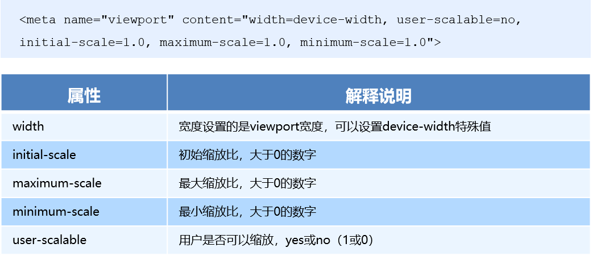

# 移动web开发布局

## 一、移动web开发布局基础

### 了解移动web

* PC端浏览器是由很多不同厂家开发的，所以它们的内核不同，开发者需要进行相关的适配。而移动端浏览器都是根据 `Webkit` 修改过来的内核，兼容移动端主流浏览器，处理Webkit内核浏览器即可。

* 现在移动端设备屏幕尺寸非常多，碎片化严重。对于移动web开发无需关注这些分辨率，因为常用的尺寸单位是 `px` 。

### 视口 `viewport`

视口（`viewport`）**就是浏览器显示页面内容的屏幕区域**。 视口可以分为布局视口、视觉视口和理想视口。

https://docs.apicloud.com/Dev-Guide/screen-adapt-guide

#### 布局视口 layout viewport

一般移动设备的浏览器都默认设置了一个布局视口，用于解决早期的**PC端页面在手机上显示的问题**。即：PC端web网页在移动设备上显示的屏幕区域。

`iOS`, `Android` 基本都将这个视口分辨率设置为 `980px`，这样PC上的网页（页面大小在 `980px`以内的）大多都能在手机上完整呈现，只不过元素看上去很小（因为手机屏幕非常小，会压缩网页大小后显示），一般默认可以通过手动缩放网页。

#### 视觉视口 visual viewport

字面意思，它是用户正在看到的网站的区域。注意：是网站的区域。对于PC端，视觉视口是浏览器的大小；对于移动端，视觉视口是手机屏幕的大小。

web网页在手机端视觉视口显示时，一般显示不全，我们可以通过缩放去操作视觉视口，但不会影响布局视口，布局视口仍保持原来的宽度。

### 理想视口 ideal viewport

为了使网站在移动端有最理想的浏览和阅读宽度而设定。理想视口，对设备来讲，是最理想的视口尺寸，可以良好的显示网页。

使用理想视口，开发者需要**手动添写meta视口标签**通知浏览器以理想视口的方式显示网页。

**meta视口标签的主要目的：** 布局视口的宽度应该与理想视口的宽度一致，简单理解就是设备有多宽，我们布局的视口就多宽

> 总结：我们开发最终会用理想视口，而理想视口就是将布局视口的宽度修改为视觉视口。

### meta 视口标签

```html
<head>
	<meta charset="utf-8">
   <!-- meta 视口标签 -->
	<meta name="viewport" content="width=device-width, user-scalable=no, initial-scale=1.0, maximum-scale=1.0, minimum-scale=1.0">
	<title></title>
</head>
```



**最标准的viewport设置**

* 视口宽度和设备保持一致
* 不允许用户自行缩放
* 视口的默认缩放比例1.0
* 最大允许的缩放比例1.0
* 最小允许的缩放比例1.0

## 二、移动 web 开发布局单位像素

在开发中经常需要设置盒子的 `width/height`，通常指定单位为 `px`，如下所示：

```html
<style type="text/css">
	.box {
		width: 100px;
		height: 100px;
		background-color: pink;
	}
</style>
<div class="box">
```

- 物理像素点指的是屏幕显示的最小颗粒，是物理真实存在的。这是厂商在设备出厂时就设置好了,比如iphone 6 是 750*1334。

- lRetina（视网膜屏幕）是一种显示技术，可以将把更多的物理像素点压缩至一块屏幕里，从而达到更高的分辨率，并提高屏幕显示的细腻程度。

- 一个px的能显示的物理像素点的个数，称为物理像素比或屏幕像素比。

**由于视网膜屏幕，在web开发时候的1px 不是一定等于1个物理像素的**

* 因此如上代码中 `width: 100px;`，对于非视网膜显示屏，盒子的大小就刚好是 `100px`；

* 而对于视网膜显示屏，盒子的宽度的方式 `100px == 实际显示的屏幕物理像素/屏幕像素比`。换而言之，web开发中的 px 对应iOS开发中的逻辑点，即 `web的375px == iOS的375pt`。

### 移动web开发图片的大小

在标准的viewport设置中，使用倍图来提高图片质量，解决在高清设备中的模糊问题。由于缩放问题，通常使用二倍图或者三倍图，如 @2x/@3x。

### 背景缩放 background-size

```
background-size: 长度|百分比|cover|contain;
```

```html
<style>
    div {
        width: 500px;
        height: 500px;
        border: 2px solid red;
        background: url(images/dog.jpg) no-repeat;
        /* background-size: 图片的宽度 图片的高度; */
        /* background-size: 500px 200px; */
        /* 1.只写一个参数 肯定是宽度 高度省略了  会等比例缩放 */
        /* background-size: 500px; */
        /* 2. 里面的单位可以跟%  相对于父盒子来说的 */
        /* background-size: 50%; */
        /* 3. cover 等比例拉伸 要完全覆盖div盒子  可能有部分背景图片显示不全 */
        /* background-size: cover; */
        /* 4. contain 高度和宽度等比例拉伸 当宽度 或者高度 铺满div盒子就不再进行拉伸了 可能有部分空白区域 */
        background-size: contain;
    }
</style>

<div></div>
```

## 三、移动 web 开发技术方案 和 布局方式

### 方案一，单独制作移动端页面 (主流方案）

移动端web单独制作，与pc端分开。可以使用的布局方式如下：

- 流式布局（百分比布局）
- flex 弹性布局（强烈推荐）
- less+rem+媒体查询布局
- 混合布局

流式布局，就是百分比布局，也称非固定像素布局。通过盒子的宽度设置成百分比来根据屏幕的宽度来进行伸缩，不受固定像素的限制，内容向两侧填充。

```html
<style>
    * {
        margin: 0;
        padding: 0;
    }
    section {
        /*通过流式布局设置盒子的百分比大小，并且指定最大/最小宽度*/
        width: 100%;
        max-width: 980px;
        min-width: 320px;
        margin: 0 auto;
    }
    section div {
        float: left;
        width: 50%;
        height: 400px;
    }
    section div:nth-child(1) {
        background-color: pink;
    }
    section div:nth-child(2) {
        background-color: purple;
    }
</style>

<section>
    <div></div>
    <div></div>
</section>
```

### 方案二，响应式

响应式页面兼容移动端，响应式网站：即pc和移动端共用一套网站，只不过在不同屏幕下，样式会自动适配。采用的布局方式如下：

* 媒体查询
* `Bootstarp框架`

## 四、移动 web 开发常见的技术解决方案

### 4.1 移动端浏览器兼容性问题

移动端浏览器基本以 `webkit` 内核为主，因此我们就考虑 `webkit` 兼容性问题。

开发者可以放心使用 `H5` 标签和 `CSS3` 样式。同时我们浏览器的私有前缀我们只需要考虑添加 `webkit` 即可。

### 4.2 移动端CSS样式初始化

移动端 CSS 初始化推荐使用 [normalize.css]( http://necolas.github.io/normalize.css/)

- Normalize.css 保护了有价值的默认值

- Normalize.css 修复了浏览器的bug

- Normalize.css 是模块化的

- Normalize.css 拥有详细的文档

### 4.3 移动端大量使用 CSS3 盒子模型，避免传统盒子模型宽度计算的问题

传统模式宽度计算：`盒子的宽度 = CSS中设置的width + border + padding`

CSS3盒子模型： `盒子的宽度= CSS中设置的宽度width 里面包含了 border 和 padding`

也就是说，我们的CSS3中的盒子模型，`padding` 和 `border` 不会撑大盒子了

如下例子，把 盒子`box2` 转换为CSS3盒子模型，其大小不受 `padding、border` 的影响：
```html
/*CSS3盒子模型*/
box-sizing: border-box;
/*传统盒子模型*/
box-sizing: content-box;
```

```html
<style type="text/css">
	.box1 {
		width: 100px;
		height: 100px;
		background-color: pink;
		border: 10px solid #ccc;
		padding: 10px;
	}
	.box2 {
		box-sizing: border-box;
		width: 100px;
		height: 100px;
		background-color: red;
		border: 10px solid #ccc;
		padding: 30px;
	}
</style>

<div class="box1"></div>
<div class="box2"></div>
```

PC端如果完全需要兼容，我们就用传统模式，如果不考虑兼容性，我们就选择 `CSS3` 盒子模型

### 4.4 禁用移动端默认标签特殊样式

```html
<style type="text/css">
	/*CSS3盒子模型*/
	div {
		box-sizing: border-box;
		/*或者 -webkit-box-sizing: border-box;*/
	}

	/*点击高亮我们需要清除清除  设置为transparent 完成透明*/
	a {
	  -webkit-tap-highlight-color: transparent;
	}

	/*在移动端浏览器默认的外观在iOS上加上这个属性才能给按钮和输入框自定义样式*/
	input {
	  -webkit-appearance: none;
	}

	/*禁用长按页面时的弹出菜单*/
	img,
	a { 
     -webkit-touch-callout: none; 
	}	
</style>
```


