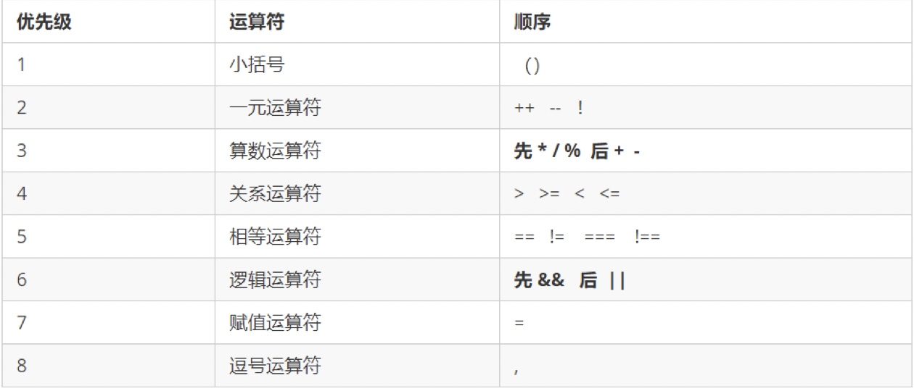

# 运算符和流程控制语句

## 一、运算符

运算符（operator）也被称为操作符，是用于实现赋值、比较和执行算数运算等功能的符号。

### 1.1、算术运算符

```javaScript
<script>
	console.log('求余数：', 5 % 3);	// 2
	console.log('求余数：', 3 % 5);	// 3
    
	// 浮点数运算会有问题，应避免
	console.log(0.1 + 0.2); // 0.30000000000000004
	console.log(0.07 * 100);// 7.000000000000001
    
	// 不要直接判断两个浮点数是否相等
	var num = 0.1 + 0.2;
	console.log(num == 0.3);    
</script>
```

> 浮点数值的最高精度是 17 位小数，但在进行算术计算时其精确度远远不如整数。
> 不要直接判断两个浮点数是否相等

### 1.2、递增递减运算符

和C语言一样，在 JavaScript 中，递增(++) 递减(--)可以放在变量前面或后面，其作用是一样的。

```javaScript
<script>
	/*
	前置递增，++ 运算符写在变量的前面。
	作用：先自加1，后返回
	*/
	var num1 = 1;
	console.log(++num1 + 10);	// 12

	/*
	后置递增，++ 运算符写在变量的后面。
	作用：先返回原值，后自加1
	*/
	var num2 = 1;
	console.log(num2++ + 10);	// 11
</script>
```

### 1.3、比较运算符

比较运算符（关系运算符）是两个数据进行比较时所使用的运算符，比较运算后，会返回一个Boolean值作为比较运算符的结果。

* 小于`<`、大于`>`、大于或等于`>=`、小于或等于`<=`、
* 等于 `==`，判断值相等
* 不等于 `!=` 
* `===` 全等于，值和类型完全相等

```javaScript
<script>
	console.log(18 == 18);	// true
	console.log('18' == 18);	// true

	console.log('18' === 18);	// false
</script>
```

> ⚠️：比较运算符默认会进行数据类型转换，把字符型转为数字值。

### 1.4、逻辑运算符

逻辑运算符是用来进行布尔值运算的运算符，其返回值也是布尔值。开发中用于多个条件的判断。

* `&&` 逻辑与
* `||` 逻辑或
* `!` 逻辑非

```javaScript
<script>
	// 1、逻辑与 &&
	console.log(3 > 5 && 3 > 2);
	console.log(3 < 5 && 3 > 2);

	// 2、逻辑或 ||
	console.log(3 > 5 || 3 < 2);
	console.log(3 > 5 || 3 > 2);

	// 3、逻辑非 !
	console.log(!true, !false);
</script>
```
#### 短路运算（逻辑中断）

逻辑运算符左边的表达式值可以确定结果时，就不再继续运算右边的表达式的值;

* `&&` 逻辑与的短路运算，如果表达式1为真，返回表达式2；如果表达式1为假，返回表达式1；

```javaScript
console.log(123 && 456);	// 456
console.log(0 && 456);	// 0
console.log(undefined && 456);	// undefined
```

* `||` 逻辑或的短路运算，如果表达式1为真，返回表达式1；如果表达式1为假，返回表达式2；

```javaScript
console.log(123 || 456);	//123
console.log(NaN || 456);	// 456
console.log(null || undefined);	// undefined
```
> 注意⚠️：短路运算会影响程序运行的结果，非常重要。

```javaScript
var num = 123;
console.log(123 || num++);
console.log(num);
```

## 三、运算符优先级

> 一元运算符里面的逻辑非优先级很高
> 逻辑与比逻辑或优先级高




## 二、流程控制语句

流程控制是来控制我们的代码按照什么结构顺序来执行的。流程控制有三种结构：顺序结构、分支结构和循环结构。

### 2.1、分支结构

#### 2.1.1、if分支语句

```javaScript
var year = prompt('请输入年份，判断是否为闰年');
if (year%4 == 0 && year%100 != 0 || year%400 == 0) {
	alert(year + '是闰年');
} else {
	alert(year + '是平年');
}
```

#### 2.1.2、三元表达式

三元运算符组成的式子称为三元表达式

* 经典案例：时间补零操作

```javaScript
<script>
	var num = 18;
	var tip = num >= 18 ? '成年人' : '未成年人';

	// 时间补零操作
	var time = prompt('请输入一个0～59之间的数字');
	var result = time < 10 ? '0' + time : time;
	alert(result);
</script>
```

#### 2.1.3、switch分支流程控制

~~~
switch (条件表达式) {
	case value1:
		// 执行语句1
		break;
	case value2:
		// 执行语句2
		break;
	default: 
		// 执行最后的语句
}
~~~

> 开发中，switch后面的条件表达式经常写成变量，便于修改。
			var variable = ;
			switch (variable) {
				//......	
			}
> switch 的 case 必须是值和类型全等才匹配，即 ===
> 每个case加break才会退出switch

```javaScript
<script>
   var age = '18';
	switch (age) {
		case 18:
			console.log('18岁了');
			break;
		case '18':
			console.log('\'18\'岁啦～');
			break;
		default: 
			break;
	}
	// 打印结果：'18'岁啦～
</script>
```	

#### 2.1.4、if 和 switch 使用场景的区别

一般情况下，if 和 switch 语句可以相互替换

- switch...case 语句通常处理 case为比较确定值的情况；而 if…else…语句更加灵活，常用于范围判断(大于、等于某个范围)
- switch 语句进行条件判断后直接执行到程序的条件语句，效率更高。而if…else 语句有几种条件，就得判断多少次。
- 当分支比较少时，if… else语句的执行效率比 switch语句高。
- 当分支比较多时，switch语句的执行效率比较高，而且结构更清晰。 

### 2.2、循环结构

**1、for循环**

```javaScript
<script>
	/*
	for (初始化变量; 条件表达式; 操作表达式) {
		// 循环体
	}
	*/
	var count = prompt('请输入班级学生总人数：');
	var sum = 0;
	for (var i = 1; i <= count; i++) {
		var score = prompt('请输入第' + i + '个学生成绩：');
		sum += parseFloat(score);
	}
	var average = sum / count;
	alert('学生成绩平均分为：' + average);
</script>
```

**2、while循环**

```javaScript
<script>
    var num = 1;
    while (num <= 100) {
    	num++;
    	console.log('执行循环体1');
    }
</script>
```

**3、do while循环**

```javaScript
<script>
	var count = 1;
	do {
		count++;
		console.log('执行循环体2');
	} while (count <= 100);
</script>
```

```javaScript
<script>
	for (var i = 1; i <= 3; i++) {
		if (i == 2) {
			continue;    // 跳出本次循环，跳出的是第2次循环，执行下一个循环
		}
		console.log('执行第' + i + '次');
	}

	for (var i = 1; i <= 3; i++) {
		if (i == 2) {
			break;   // break 直接退出整个 for 循环，跳到整个for循环下面的语句
		}
		console.log('执行第' + i + '次');
	}
</script>
```