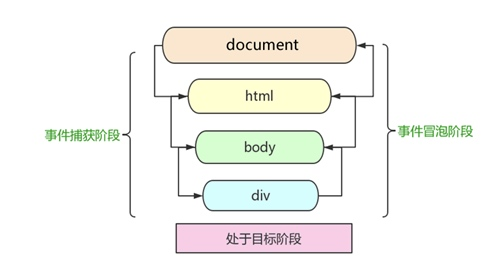

# 事件高级

## 一、注册事件的两种方式

给元素添加事件，称为注册事件或者绑定事件。注册事件有两种方式：传统方式 和 方法监听注册方式

### 1.1、传统注册事件的方式

利用 `on` 开发的事件，注册事件具有唯一性，**同一个元素的同一个事件只能设置一个处理函数**，最后注册的函数将会覆盖前面注册的函数。

```js
<button>点击</button>

<script>
    var btns = document.querySelectorAll('button');
    btns[0].onclick = function() {
		alert('你好！');
    }
    btns[0].onclick = function() {
		alert('hello！');
    }
</script>
```

### 1.2、监听注册方式
	
`eventTarget.addEventListener(type, listener[, useCapture])`：将指定的监听器注册到 目标对象(`eventTarget`)上，当该 `eventTarget` 触发指定的事件时，会执行事件处理函数(`listener`)。

`addEventListener()` 是 w3c标准，支持IE9+，特点：**同一个元素同一个事件可以注册多个监听器，按注册顺序依次执行**。

`type`：时间类型字符串，比如：`click`、`mouseover`，**注意都不带 `on`**。
`listener`：事件处理函数，事件发生时，会调用该监听函数。
`useCapture`：可选参数，默认 `false`，与 `DOM`事件流相关。

```javaScript
<button>点击</button>

<script>
    var btn = document.querySelector('button');
    btn.addEventListener('click', function() {
		console.log('---1');
    });
    
    btn.addEventListener('click', function() {
		console.log('---2');
    });
</script>
```

### 1.2、删除事件（解绑事件）

```javaScript
<div>1</div>
<div>2</div>
<div>3</div>
<script>
	// 1、传统事件解绑事件
	var divs = document.querySelectorAll('div');
	divs[0].onclick = function () {
		alert(11);
		divs[0].onclick = null;	// 删除事件
	};

	// 2、注册方式解绑事件
	divs[1].addEventListener('click', fn);

	function fn() {
		alert(22);
		divs[1].removeEventListener('click', fn);
	}
</script>
```

## 二、DOM事件流

html中的标签都是相互嵌套的，当你单击一个div时，同时你也单击了div的父元素，甚至整个页面。那么是先执行父元素的单击事件，还是先执行div的单击事件 ？

事件流描述的是从页面中接收事件的顺序。事件发生时会在元素节点之间按照特定的顺序传播，这个传播过程即DOM事件流。

* 事件捕获：网景最早提出，由DOM最顶层节点开始，然后逐级向下传播到最具体的元素的接收过程。
* 事件冒泡：IE最早提出，事件开始时是由最具体的元素接收，然后逐级向上传播到DOM最顶层节点过程。

当时的2大浏览器霸主谁也不服谁！
> IE 提出从目标元素开始，然后一层一层向外接收事件并响应，也就是冒泡型事件流。
> Netscape（网景公司）提出从最外层开始，然后一层一层向内接收事件并响应，也就是捕获型事件流。
> 
> 最终，w3c 采用折中的方式，平息了战火，制定了统一的标准 —--— 先捕获再冒泡。
> 现代浏览器都遵循了此标准，所以当事件发生时，会经历3个阶段。

DOM事件流分为3个阶段：
	1、捕获阶段
	2、当前目标阶段
	3、冒泡阶段
	



**DOM事件流的特点：(重点)**

1. JS 代码中只能执行捕获或者冒泡其中的一个阶段。
2. onclick 只能得到冒泡阶段
3. addEventListener 第三个参数如果是true，表示在事件捕获阶段调用事件处理程序；如果是false，表示在事件冒泡阶段调用事件处理程序。默认值是 false。
4. 实际开发中很少使用事件捕获，更多关注事件冒泡
5. 有些事件是没有冒泡的，比如：onblur、onfocus、onmouseenter、onmouseleave
6. 事件冒泡有时候会带来麻烦，有时候会帮助很巧妙的做某些事件。

### 2.1、事件捕获

如下例子，设置son在捕获阶段调用事件处理函数：

> 捕获阶段顺序：document > html > body > father > son

```javaScript
<div class="father">
	<div class="son"> son盒子</div>
</div>

<script>
    var son = document.querySelector('.son');
    son.addEventListener('click', function() {
    	alert(111);
    }, true);
    
    var father = document.querySelector('.father');
    father.addEventListener('click', function() {
    	alert(222);
    }, true);
</script>
```

### 2.2、事件冒泡

如下例子，设置son在冒泡阶段调用事件处理函数，
冒泡阶段顺序：son > father  > body > html > document

```javaScript
<div class="father">
	<div class="son"> son盒子</div>
</div>

<script>
    var son = document.querySelector('.son');
	son.addEventListener('click', function() {
		alert('一一');
	}, false);

	var father = document.querySelector('.father');
	father.addEventListener('click', function() {
		alert('二二');
	}, false);

	document.addEventListener('click', function() {
		alert('document');
	}, false);
</script>
```

## 三、事件对象

事件发生后，跟事件相关的一系列信息数据的集合都放到这个对象里面，这个对象就是事件对象。

事件触发发生时就会产生事件对象，并且系统会以实参的形式传给事件处理函数。所以，在事件处理函数中声明1个形参用来接收事件对象。

### 3.1、事件对象的获取

事件对象本身的获取存在兼容问题：

1. 标准浏览器中是浏览器给方法传递的参数，只需要定义形参 e 就可以获取到。

2. 在 IE6~8 中，浏览器不会给方法传递参数，如果需要的话，需要到 `window.event` 中获取查找。

* 如下例子获取：事件、绑定事件的对象、触发事件的对象：

```javaScript
<div>123</div>
<ul>
	<li>苹果</li>
	<li>香蕉</li>
	<li>栗子</li>
</ul>

<script>
   var div = document.querySelector('div');
	
	div.onclick = function(event) {
		// event 就是一个事件对象，写到事件函数的第一个形式参数里
		// 事件对象只有有了事件才会存在，它是系统自动创建的。
		// 事件对象是事件的一系列相关数据的集合。
		console.log(event);
	}
	
	div.addEventListener('click', function(e) {
		console.log('触发事件的对象：', e.target);
		console.log(e);
	});

	var ul = document.querySelector('ul');
	ul.addEventListener('click', function(e) {
	   // e表示事件对象，它由系统创建，里面包含事件的一些信息
		e = e || window.event;
		
		console.log('this指向函数的调用者，绑定事件的对象', this); // 打印：ul
		// this 有个非常相似的属性 currentTarget  ie678不认识
		console.log('和this类似的属性：', e.currentTarget);

      var target = e.target || e.srcElement;    // e.srcElement 兼容低版本
		console.log('触发事件的对象，即被点击的对象：', target); // 打印：li      
	});
</script>
```

### 3.2、阻止事件对象的默认行为

* 阻止 a 链接的跳转；阻止form表单默认提交行为；

```javaScript
<a href="https://www.baidu.com">百度</a>
<form action="http://www.baidu.com">
    <input type="submit" value="提交" name="sub">
</form>

<script>
    var a = document.querySelector('a');
    // 1、方法监听注册方式 注册事件
    a.addEventListener('click', fn, false);

	function fn(e) {
        console.log('事件类型：', e.type);
        e.preventDefault(); //  dom 标准写法
        console.log('此方式阻止事件对象的默认行为，e.preventDefault 之后的代码也会正常执行');
    }

    // 2、传统方式 注册事件
    var input = document.querySelector('input');
    input.onclick = function(e) {
    	// 普通浏览器
    	// e.preventDefault();

    	// 低版本浏览器 ie678 使用 returnValue 属性
    	// e.returnValue;

    	// return false 也能阻止默认行为 
    	// return 后面的代码不执行了，而且只限于传统的注册方式
    	return false;
    	console.log('return false可以阻止事件对象的默认行为，但是return 后面的代码不执行了');
    }
</script>
```

### 3.3、阻止事件冒泡

* `e.stopPropagation();` 阻止事件冒泡，DOM 推荐的标准。

如下例子：正常来说点击 son  会依次执行：`alert('son'); > alert('father'); > alert('document');`

```js
<div class="father">
    <div class="son">son儿子</div>
</div>
   
<script>
    // 常见事件对象的属性和方法
    // 阻止冒泡  dom 推荐的标准 stopPropagation() 
    var son = document.querySelector('.son');
    son.addEventListener('click', function(e) {
        alert('son');
        e.stopPropagation(); // stop 停止  Propagation 传播
        e.cancelBubble = true; // 非标准 cancel 取消 bubble 泡泡
    }, false);

    var father = document.querySelector('.father');
    father.addEventListener('click', function() {
        alert('father');
    }, false);
    document.addEventListener('click', function() {
        alert('document');
    })
</script> 
```

### 3.4、事件委托

事件委托的核心原理：给父节点添加侦听器，利用事件冒泡影响每一个子节点。

```js
<ul>
    <li>点击li-1</li>
    <li>点击li-2</li>
    <li>点击li-3</li>
</ul>

<script>
    var ul = document.querySelector('ul');
    // 只给ul添加注册事件，冒泡时，来修改li
    ul.addEventListener('click', function(e) {
        e.target.style.backgroundColor = 'pink';
    })
</script>
```

## 四、其它事件

### 4.1、鼠标事件

* 鼠标事件对象

```js
<script>
    // 鼠标事件对象 MouseEvent
    document.addEventListener('click', function(e) {
        // 1. client 鼠标在可视区的x和y坐标
        console.log('鼠标在可视区的x和y坐标：');
        console.log(e.clientX);
        console.log(e.clientY);

        // 2. page 鼠标在页面文档的x和y坐标
        console.log('鼠标在页面文档的x和y坐标：');
        console.log(e.pageX);
        console.log(e.pageY);

        // 3. screen 鼠标在电脑屏幕的x和y坐标
        console.log('鼠标在电脑屏幕的x和y坐标：');
        console.log(e.screenX);
        console.log(e.screenY);

    })
</script>
```

* 常用的鼠标事件

`mousemove`：鼠标移动的事件。
`mouseenter`：当鼠标移动到元素上时就会触发 mouseenter 事件，如果经过其子元素不会触发。即不会冒泡。
`mouseover`：当鼠标移动到元素或其子元素上时，会被触发。
`mouseleave`：当鼠标离开会被触发。

* 禁止鼠标右键和选中文字

```js
<div>禁止鼠标右键和选中文字</div>

<script>
    // 1. contextmenu 我们可以禁用右键菜单
	document.addEventListener('contextmenu', function(e) {
        e.preventDefault();
    })

	// 2. 禁止选中文字 selectstart
    document.addEventListener('selectstart', function(e) {
        e.preventDefault();
    })
</script>
```

### 4.2、键盘事件

#### 键盘事件执行的顺序：`keydown -> keypress -> keyup`

```js
<script>
    // document.onkeydown = function() {
    //         console.log('按下了键盘down');
    //     }
    
    // 1、keydown 按键按下的时候触发  能识别功能键 比如 ctrl shift 左右箭头啊
    document.addEventListener('keydown', function() {
        console.log('按下了键盘down');
    })
    
    // 2、keypress 按键按下的时候触发  不能识别功能键 比如 ctrl shift 左右箭头啊
    document.addEventListener('keypress', function() {
        console.log('按下了键盘press');
    })
    // 3、keyup 按键松开了
    document.addEventListener('keyup', function() {
        console.log('键盘弹起了');
    })
</script>
```

#### 键盘事件对象的 keyCode 属性，表示键的ASCII码值

```js
document.addEventListener('keydown', function(e) {
    console.log('不区分字母大小写', e.keyCode);
})
document.addEventListener('keypress', function(e) {
    console.log('区分字母大小写', e.keyCode);
})
document.addEventListener('keyup', function(e) {
    console.log('不区分字母大小写', e.keyCode);

})
```

例子：如果按下s 键，就把光标定位到搜索框里面

```js
<input type="text">
<script>
    var search = document.querySelector('input');
    document.addEventListener('keyup', function(e) {
        if (e.keyCode === 83) {
            // 获得焦点
            search.focus();
        }
    })
</script>
```

