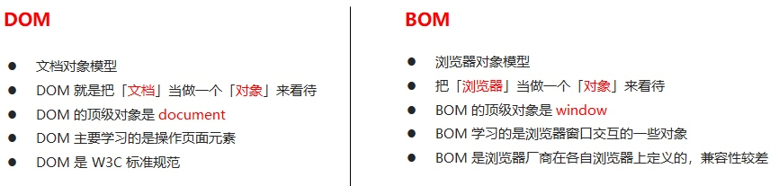
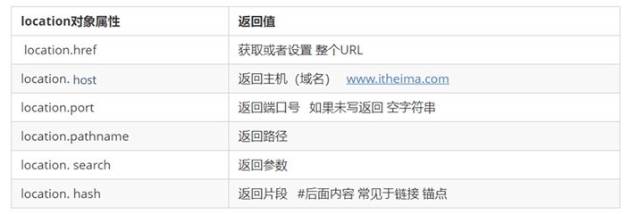

# 操作BOM

## 一、什么是 BOM ？

`BOM（Browser Object Model）`即浏览器对象模型，它提供了独立于内容而与浏览器窗口进行交互的对象，**其核心对象是 `window`**。

`BOM` 缺乏标准，`JavaScript` 语法的标准化组织是 `ECMA`，`DOM` 的标准化组织是 `W3C`，`BOM` 最初是`Netscape` 浏览器标准的一部分。



> `BOM` 比 `DOM` 更大，它包含 `DOM`。
> 
> `window` 对象包含：`document`、`location`、`navigation`、`screen`、`history`...


## 二、使用 Window 对象

## 2.1、window 对象

window 对象是浏览器的顶级对象，它具有双重角色：

> 1、它是JS访问浏览器窗口的一个接口；
> 2、他是一个全局对象，定义在全局作用域的变量、函数都会变成 `window` 对象的属性和方法。
在使用 `window` 的属性、方法时可以省略 `window`，比如：alert()、prompt()等。
> ⚠️：`window` 的一个特殊属性，`window.name`，一般不要定义属性名称为 name

```js
<script>
    var num = 10;
    console.log(num, window.num);

    function fn() {
    	console.log('----全局函数');
    }

    fn();
    window.fn();

    console.dir('---window的详细信息：', window);
</script>
```

### 2.2、window对象的常见事件

#### 页面加载事件 `load`、`DOMContentLoaded`

* `window.onload` 是窗口 (页面）加载事件，**当文档内容完全加载完成**会触发该事件(包括图像、脚本文件、CSS 文件等), 就调用的处理函数。
* `DOMContentLoaded` 事件触发时，仅当DOM加载完成，不包括样式表，图片，flash等等。

```js
<script type="text/javascript">
	window.onload = function() {
		console.log('文档内容完全加载完成时执行');
	};
	window.addEventListener('load', function() {
		console.log('文档内容完全加载完成时执行');

		// 页面加载完毕时，给button绑定事件
		let btn = document.querySelector('button');
		btn.addEventListener('click', function() {
			console.log('点击按钮');
		})
	});

	document.addEventListener('DOMContentLoaded', function() {
        console.log('仅当DOM加载完成，比load更快一些');
    });
</script>

<button>点击</button>
```

#### 页面显示时事件 `pageshow`

当页面加载、点击a标签超链接、F5刷新、浏览器上前进后退时，都会触发 `load` 事件。
但是在火狐浏览器上，它会往返缓存整个页面到内存中，这样前进后退就不会触发 `load` 事件。

`pageshow` 件在页面显示时触发，无论页面是否来自缓存。在重新加载页面中，pageshow会在load事件触发后触发；

```js
<script>
    // console.log(window.devicePixelRatio);
    window.addEventListener('pageshow', function() {
        if (e.persisted) {
            console.log('e.persisted 返回的是true 就是说如果这个页面是从缓存取过来的页面');
        }
        alert(11);
    })
</script>
<a href="http://www.itcast.cn">链接</a>
```


#### `resize` 调整窗口大小事件，用于响应式布局时使用

```js
window.addEventListener('load', function() {
    var div = document.querySelector('div');
    window.addEventListener('resize', function() {
        console.log(window.innerWidth);

        console.log('变化了');
        if (window.innerWidth <= 800) {
            div.style.display = 'none';
        } else {
            div.style.display = 'block';
        }

    })
})
```

### 2.3、定时器

#### setTimeout() 延迟定时器；clearTimeout() 清除定时器

```js
<div style="width: 100px; height: 100px; background-color: pink;"></div>
<button>清除隐藏</button>

<script>
	var timer = setTimeout(function() {
		console.log('3秒后，隐藏pink');
		var box = document.querySelector('div');
		box.style.display = "none";
	}, 3000);

	var btn = document.querySelector('button');
	btn.addEventListener('click', function() {
		console.log('清除定时器');
		clearTimeout(timer);
	});
</script>
```

#### setInterval() 循环定时器；clearInterval() 清除定时器

```js
<button class="begin">开启定时器</button>
    <button class="stop">停止定时器</button>

<script>
	var begin = document.querySelector('.begin');
    var stop = document.querySelector('.stop');

    var timer = null; // 全局变量  null是一个空对象
    begin.addEventListener('click', function() {
        timer = setInterval(function() {
            console.log('每个1秒允许一次');
        }, 1000);
    })
    stop.addEventListener('click', function() {
    	console.log('清除定时器');
        clearInterval(timer);
    })

</script>
```

#### 给对象清除timer属性，方便清除定时器

```js
function animate(obj, target) {
    // 先清除定时器
    clearInterval(obj.timer);
    // 添加定时器
    obj.timer = setInterval(function() {
        if (obj.offsetLeft >= target) {
            // 达到条件后，再清除定时器
            clearInterval(obj.timer);
        }
        obj.style.left = obj.offsetLeft + 1 + 'px';
    }, 30);
}
```

## 三、window.location 对象

`window` 对象提供了一个 `location` 属性，用于获取设置窗体的URL，并且可以解析URL，因为这个属性返回的是一个对象，所以我们将这个属性也称为 `location` 对象。

### 3.1、location 对象的属性



```js
<script>
	console.log('页面URL地址，href=', window.location.href);
	console.log('页面URL后面接的参数，search=', window.location.search);
	
	var timer = 5;
	var div = document.querySelector('div');
    setInterval(function() {
        if (timer == 0) {
            location.href = 'http://www.itcast.cn';
        } else {
            div.innerHTML = '您将在' + timer + '秒钟之后跳转到首页';
            timer--;
        }
    }, 1000);
</script>
```

### 3.1、location 对象常用方法

> `location.assign('')` 和 `href` 一样可以跳转页面，也被称为重定向页面，可以后退页面。
> `location.replace('')` 替换当前页面，不记录历史，所以不能后退页面。
> `location.reload(true)` 重新加载页面，false 相当于f5按钮；true 强制刷新ctrl+f5。

```js
<button class="begin">跳转</button>

<script>
	var btn = document.querySelector('button');
    
    btn.addEventListener('click', function() {
        // 1、记录浏览历史，可以实现后退功能
        location.assign('https://www.baidu.com');
        
        // 2、不记录浏览历史，不可以实现后退功能
        // location.replace('https://www.baidu.com');
        
        // 3、强刷页面
        // location.reload(true);
    })
</script>
```

## 四、window.navigator 对象

`navigator` 对象包含有关浏览器的信息，它有很多属性，我们最常用的是 `userAgent`，该属性可以返回由客户机发送服务器的 `user-agent` 头部的值。

下面前端代码可以判断用户那个终端打开页面，实现跳转

```js
<script>
    console.log('---浏览器信息：', window.navigator.userAgent);
    
    if((navigator.userAgent.match(/(phone|pad|pod|iPhone|iPod|ios|iPad|Android|Mobile|BlackBerry|IEMobile|MQQBrowser|JUC|Fennec|wOSBrowser|BrowserNG|WebOS|Symbian|Windows Phone)/i))) {
        // window.location.href = "移动端URL地址";     //手机
        console.log('手机');
    } else {
        // window.location.href = "PC端URL地址";     //电脑
        console.log('电脑');
    }
</script>
```

## 五、window.history 对象

`window.history` 对象包含用户（在浏览器窗口中）访问过的URL。

> `window.history.back();`  后退功能
> `window.history.forward();` 前进功能
> `window.history.go(参数Int);` 前进后退功能。参数Int，1前进1个页面；-1后退一个页面；


## 六、JS 事件执行队列

1、如下例子，为什么 `x` 最后打印？

```js
<script>
	console.log('-----1');
	setTimeout(function() {
		console.log('-----x');
	}, 0);
	console.log('-----2');
	console.log('-----3');
</script>
```

2、如下例子，为什么 onclick 可以随时被执行？

```js
<script>
	console.log(1);
    document.onclick = function() {
        console.log('click');
    }
    console.log(2);
    setTimeout(function() {
        console.log(3)
    }, 3000)
</script>
```

利用多核 CPU 的计算能力，HTML5 提出 Web Worker 标准，允许 JavaScript 脚本创建多个线程，但是子线程完全受主线程控制。于是，JS 中出现了**同步任务**和**异步任务**。


> JS中所有任务可以分成两种，一种是同步任务（synchronous），另一种是异步任务（asynchronous）。

* 同步任务指的是：
在主线程上排队执行的任务，只有前一个任务执行完毕，才能执行后一个任务；

* 异步任务指的是：
不进入主线程、而进入”任务队列”的任务，**当主线程中的任务运行完了**，才会从”任务队列”取出异步任务放入主线程执行。

> js中主线程会不断的重复获得任务、执行任务、再获取任务、再执行，这种机制被称为事件循环(eventloop)。
